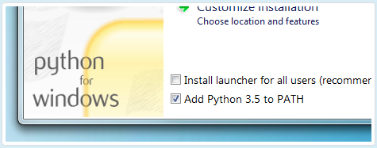
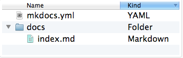
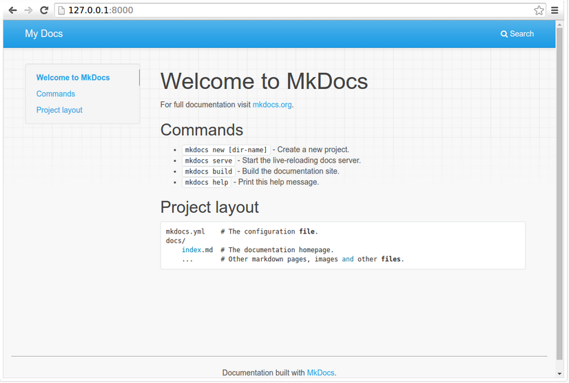
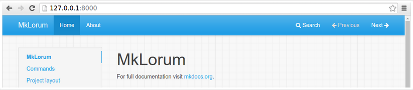
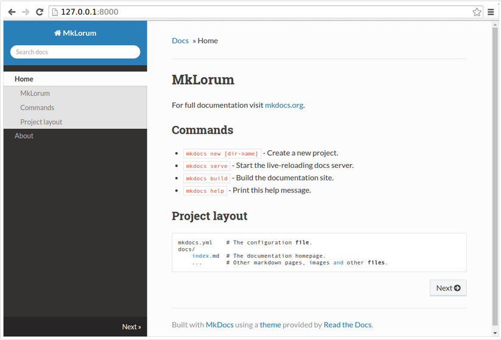

# **MkDocs**
***

## **A. Penjelasan**

MkDocs adalah generator situs statis yang cepat, sederhana dan benar-benar cantik yang diarahkan untuk membuat dokumentasi proyek. File sumber dokumentasi ditulis dalam penurunan harga, dan dikonfigurasi dengan file konfigurasi YAML tunggal. MkDocs membangun situs HTML statis yang bisa Anda host di halaman GitHub, Amazon S3, atau tempat lain yang Anda pilih.

a. Memiliki Tema yang bagus

Ada beberapa tema bagus yang tersedia untuk MkDocs. Pilih antara tema bawaan: mkdocs dan readthedocs, pilih salah satu tema pihak ke-3 dalam wiki MkDocs, atau buat sendiri.

b. Pratinjau situs Anda saat Anda bekerja

Built-in dev-server memungkinkan Anda untuk melihat pratinjau dokumentasi Anda saat Anda menuliskannya. Ini bahkan akan otomatis memuat ulang dan menyegarkan browser Anda setiap kali Anda menyimpan perubahan Anda.

c. Mudah untuk menyesuaikan

Dapatkan dokumentasi proyek Anda sesuai dengan keinginan Anda dengan menyesuaikan tema.
***

## **B. Tutorial Installasi**

### Install Python

Download python di https://www.python.org/ dan setelah itu di instal. MkDocs mendukung python versi 2.6, 2.7, 3.3, 3.4, 3.5 dan pypy

Note :

Jika menginstal Python di Windows, pastikan untuk mencentang kotak yang telah ditambahkan Python ke PATH Anda jika penginstal menawarkan opsi semacam itu (biasanya dinonaktifkan secara default).

 

Ketikkan pada CMD (Command Prompt) untuk mengetahui versi dari python dan versi dari pip jika telah terinstal

	$ python --version
	Python 2.7.2
	$ pip --version
	pip 1.5.2

### Install PIP

Jika menggunakan versi Python terbaru, pengelola paket Python, pip, kemungkinan besar terinstal secara default. Namun, Anda mungkin perlu meng-upgrade pip ke versi terakhir :

	pip install --upgrade pip

Jika Anda perlu menginstal pip untuk pertama kalinya yaitu download get-pip.py. Kemudian jalankan perintah berikut untuk menginstalnya di CMD (Command Prompt)  :

	python get-pip.py

### Install MkDocs

Instal “mkdocs” menggunakan pip :

	pip install mkdocs

Anda sekarang harus memiliki perintah “mkdocs” yang terinstal di sistem Anda. Jalankan “mkdocs”
“--version” untuk memeriksa semuanya berjalan baik.

	$ mkdocs --version
	mkdocs, version 0.15.3
***

## **C. Tutorial Penggunaan**

### Membuat project baru

Memulai dengan mudah

	mkdocs new my-project
	cd my-project

Tampilan untuk melihat proyek yang telah dibuat

 

Ada file konfigurasi tunggal bernama “mkdocs.yml”, dan sebuah folder bernama “docs” yang berisi file sumber dokumentasi. Folder “docs” hanya berisi satu halaman dokumentasi, bernama “index.md”. MkDocs dilengkapi dengan built-in dev-server untuk melihat peninjauan dokumentasi saat mengerjakannya. Pastikan berada di direktori yang sama dengan file konfigurasi “mkdocs.yml”, kemudian jalankan server dengan menjalankan perintah serve mkdocs :

	$ mkdocs serve

 

Buka http://127.0.0.1:8000/ di browser Anda, dan Anda akan melihat halaman muka default yang ditampilkan:

 

Dev-server juga mendukung auto-reloading, dan akan mendapatkan kembali dokumentasi Anda kapan pun ada sesuatu di file konfigurasi, direktori dokumentasi, atau perubahan direktori tema.

Buka dokumen “docs / index.md” di editor teks pilihan Anda, ganti judul awal ke “MkLorum”, dan simpan perubahan Anda. Browser akan otomatis dimuat ulang dan Anda harus segera melihat dokumentasi yang telah diperbarui.

Sekarang coba edit file konfigurasi: “mkdocs.yml”. Ubah pengaturan “site_name” ke “MkLorum” dan simpan file tersebut.

	site_name: MkLorum

Browser harus segera memuat ulang, dan Anda akan melihat nama situs baru yang telah berlaku.

 

### Menambahkan Halaman

Situs dokumentasi akan menyertakan beberapa header navigasi, Anda boleh untuk mengedit file konfigurasi dan menambahkan beberapa informasi tentang urutan, judul, dan nesting setiap halaman di header navigasi dengan menambahkan pengaturan “page” :

	site_name: MkLorum
	pages:
		- Home: index.md
		- About: about.md

Simpan perubahan Anda  dan sekarang Anda akan melihat bagian navigasi dengan item “Home” dan “About” item di sebelah kiri serta item “Search”, “Previous”, dan item “Next” di sebelah kanan.

Cobalah item menu dan navigasikan kembali antar halaman. Lalu klik “Search”. Dialog pencarian akan muncul, memungkinkan Anda untuk mencari teks apapun pada halaman manapun. Perhatikan bahwa hasil pencarian mencakup setiap hasil kemunculannya istilah pencarian di situs dan link langsung ke bagian halaman di mana istilah pencarian muncul. Anda mendapatkan semua itu tanpa usaha atau konfigurasi dari pihak Anda!

### Tema Dokumentasi

Sekarang ubah file konfigurasi untuk mengubah bagaimana dokumentasi ditampilkan dengan mengubah tema. Edit file mkdocs.yml dan tambahkan setting “theme” :

	site_name: MkLorum
	pages:
		- Home: index.md
		- About: about.md
	theme: readthedocs

Simpan perubahan, dan Anda akan melihat tema ReadTheDocs yang sedang digunakan.

### Mengubah Ikon Favicon

Secara default, MkDocs menggunakan “ikon favicon MkDocs”. Untuk menggunakan ikon yang berbeda, buat subdirektori “img” di “docs_dir” dan salin file “favicon.ico” kustom ke direktori itu. MkDocs akan mendeteksi dan menggunakan file tersebut secara otomatis sebagai ikon favicon Anda.

### Membangun Situs

Terlihat bagus. Jika Anda siap untuk menyebarkan pass pertama dari dokumentasi “MkLorum” Anda. Pertama membangun dokumentasi :

	mkdocs build

Ini akan membuat direktori baru, bernama ”site”. Lihatlah di dalam direktori:

	$ ls site

Perhatikan bahwa dokumentasi sumber telah dihasilkan sebagai dua file HTML yang bernama “index.html” dan “about / index.html”. Anda juga memiliki berbagai media lain yang telah disalin ke direktori “site” sebagai bagian dari tema dokumentasi. Bahkan memiliki file “sitemap.xml” dan “mkdocs / search_index.json”.
Jika Anda menggunakan kontrol kode sumber seperti “git” Anda mungkin tidak ingin memeriksa dokumentasi Anda ke dalam repositori. Tambahkan baris yang berisi “situs /”  ke file “.gitignore” Anda.

Jika menggunakan alat kontrol kode sumber lain, Anda pasti ingin memeriksanya tentang cara mengabaikan direktori tertentu.

Setelah beberapa lama, file dapat dihapus dari dokumentasi namun tetap berada di direktori “site”. Untuk menghapus file basi tersebut, cukup jalankan “mkdocs” dengan tombol “--clean” 

	mkdocs build --clean

### Perintah lainnya

Ada berbagai perintah dan pilihan lain yang tersedia. Untuk daftar perintah yang lengkap, gunakan “--help” flag :

	mkdocs --help

Untuk melihat daftar opsi yang tersedia pada perintah yang diberikan, gunakan “--help” flag dengan perintah itu. Sebagai contoh, untuk mendapatkan daftar semua opsi yang tersedia untuk perintah “build” jalankan perintah berikut:

	Mkdocs build --help

### Menyebarkan

Situs dokumentasi yang baru saja dibuat hanya menggunakan file statis sehingga Anda bisa meng-hostnya dari mana saja. “Halaman proyek GitHub” dan “Amazon S3” mungkin pilihan hosting yang bagus, tergantung kebutuhan Anda. Upload konten dari seluruh direktori “site” ke mana pun Anda hosting situs web dan selesai. Untuk petunjuk khusus tentang sejumlah host umum, lihat halaman “Deploying Docs Anda”

### Mendapatkan Bantuan

Untuk mendapatkan bantuan dengan MkDocs, gunakan “grup diskusi”, masalah GitHub atau kanal IRC MkDocs “#mkdocs” pada freenode.
