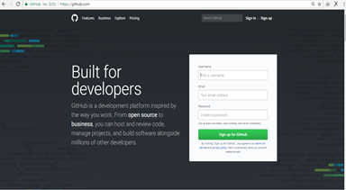
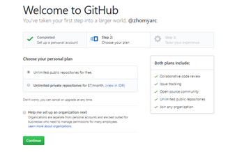
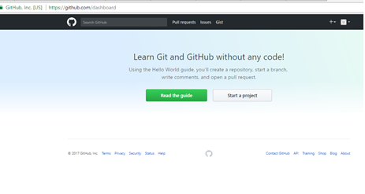
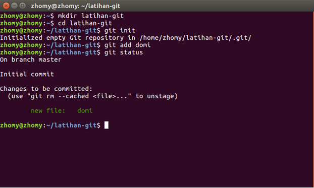
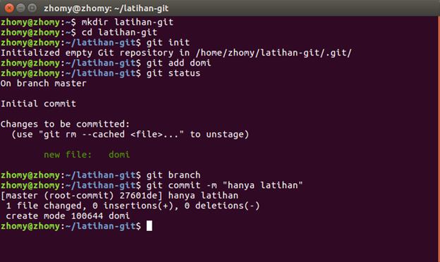
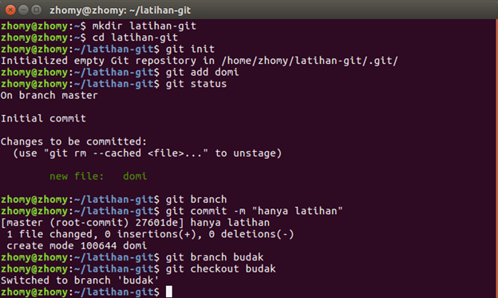
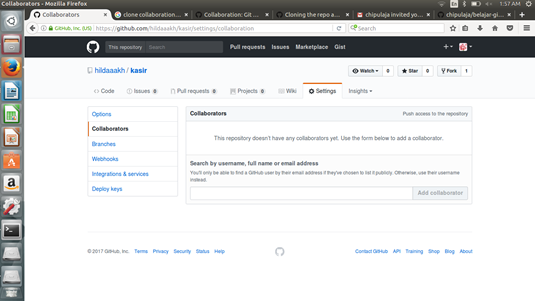
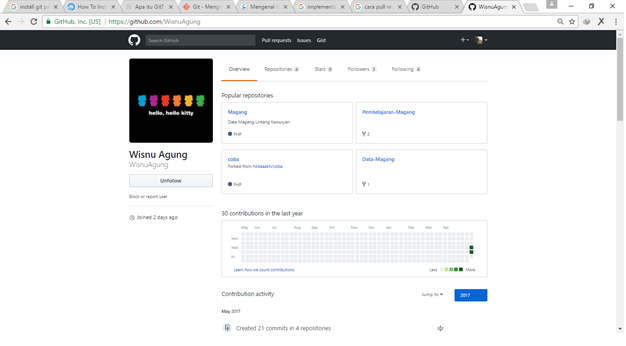
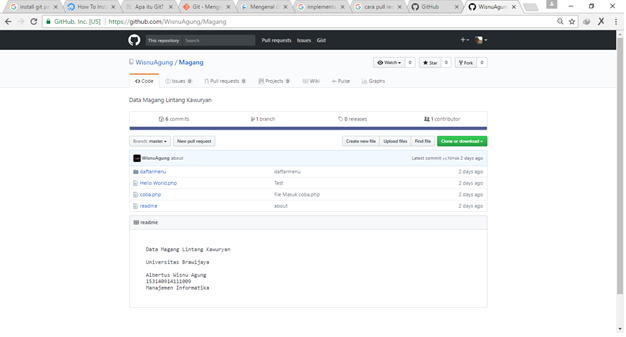
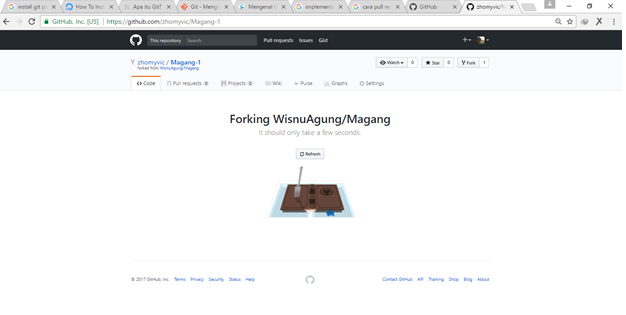

# **GITHUB**
***

## **A. Penjelasan**

Git adalah tools yang berfungsi sebagai Version Control System (VCS) dan kalau diartikan ke bahasa kita artinya sebuah sistem pelacak perubahan pada file. Git itu bukanlah sebuah bahasa seperti halnya HTML,CSS atau Js bukan pula sebuah konsep atau aturan baku dalam pemrograman, melainkan sebuah software yang berfungsi untuk mengatur source code dari aplikasi yang sedang anda buat.
Fungsi utamanya adalah untuk mengatur versi dari source code anda, menambahkan tanda/checkpoint ketika terjadi perubahan pada kode Anda dan tentunya akan mempermudah Anda untuk tetap mengetahui apa saja yang berubah dari source code Anda. Pada awalnya Git digunakan untuk membantu pengembangan Kernel Linux sebelum akhirnya dipakai lebih luas di berbagai pengembangan software lainnya dan dibuat multi-platform sehingga tersedia di hampir semua OS.
***

## **B. Tutorial Installan**

### Install Github di linux

1. Menginstall Git untuk Linux
	
Menginstall Git untuk Ubuntu, kamu hanya perlu mengetik perintah ini di terminal:
	
	$ sudo apt-get install git
	
2. Konfigurasi Github

Ketika proses instalasinya udah berhasil, langkah selanjutnya adalah set up konfigurasi detail untuk user GitHub, dengan mengetikkan kode dibawah ini. Kamu ganti "user_name" sama username GitHub kamu dan "email_id" kamu ganti sama email-id yang kamu pakai sewaktu membuat akun GitHub kamu. Nah, di bawah ini perintahnya:
	
	$ git config --global user.name "user_name"
	$ git config --global user.email "email@domain.com"
***

## **C. Tutorial Penggunaan** 

### Buat Akun

1. Membuka website https://github.com/

	 

2. Kemudian mengisi Username, Email, dan password , setelah itu akan muncul halaman berikut 

	 

3. Kemudian klik Pilih Sesuai kebutuhan dan Kemudian Continue sampai selesai kemudian akan muncul halaman

	 

4. Pada Halaman ini kita masih belum bisa menggunakan github karena kita harus memverifikasi akun yang dikirimkan ke email. Buka email kemudian klik verify email address dan akun sudah bisa dipakai.

### Upload File 

Untuk meupload file di github pertama-tama kita buat folder baru untuk projek kita dan kita beri nama latihan-git dengan menuliskan kode 

	$ mkdir latihan-git
	
Setelah membuat folder latihan-git navigasikan terminal kedalam folder latihan-git dengan perintah

	$ cd latihan-git
	
Agar projek kita dapat diatur oleh git, maka kita perlu melakukan inisiasi git terlebih dahulu, caranya dengan mengetikkan perintah :

	$ git init
	
Perintah tersebut akan membuat folder .git dan didalamnya berisi file-file yang akan digunakan oleh Git untuk mengatur dan mengontrol project kita.	
	Setelah itu buatlah file dalam folder latihan-git yaitu klik kanan kemudian new document contoh beri nama domi. Kemudian ketikkan perintah 
	
	$ git add domi
	
Untuk mengetahui file sudah berhasil diupload atau tidak ketikka perintah
 
	$ git status 
	
 

Lalu akan muncul status file
Setelah file telah terupload kemudian commit file tersebut dengan perintah 

	 $ git commit -m “keterangan”

 

Commit berguna untuk menandai file ketika membuat dan diubah kita bisa memberi keterangan misal tanggal.Dan perintah -m untuk menambahkan keterangan misal tanggal.

### Hapus File

1. Buka dulu folder project git

2. Kemudian ketikkan perintah

		$ git rm (nama_file) 

		$ git commit -m "(keterangan)"

3. Setelah itu di push lagi

		$ git push

### Buat Branch 

Misalkan anda ingin menambahkan suatu fitur, namun anda tidak mau kode yang ada sekarang rusak karena fitur yang akan anda tambahkan masih belum stabil, Dalam Git anda dapat membuat branch terlebih dahulu. Branch ini bisa diartikan sebagai cabang dari branch master. segala perubahan yang anda lakukan pada branch yang anda buat tidak akan berpengaruh pada branch lainnya.
Sebagai contoh kita buat branch dengan nama budak dengan perintah

	$ git branch budak
	
Jika perintah dijalankan dengan benar maka ketika anda mengetikkan perintah git branch akan muncul branch-branch yang telah dibuat.

  	 budak
*   master

tanda Bintang menandakan bahwa anda sedang bekerja pada branch master, untuk berpindah ke branch yang baru saja dibuat (fix-css) ketikkan perintah berikut:

	$ git checkout budak

Jika peritah di atas benar, maka akan ada pemberitahuan seperti berikut:
	

	Switched to branch 'budak'
	
### Hapus Branch

Cara menghapus branch iyalah mengetikkan perintah

	$ git branch -d branch-name

### Kolaborasi

1. Buka Repository Kemudian Pilih Setting

2. Kemudian Klik Collaboration dan masukkan id atau email yang mau di add pada textbox 

3. klik "add collaboration"

	

### Fork

Mengambil File dengan Menu Fork :

1. Buka File yang akan di fork di profile orang yang mempunyai file yg ingin di fork 

	

2. setelah muncul seperti halaman di bawah kemudian klik menu fork di pojok kanan atas 

	

3. setelah klik fork maka file yg di fork sudah ada di profile 

	

### Kasus

1. Untuk mengetahui apa saja yang telah dirubah menurut branch
	
		$ git log --decorate
			
2. Untuk mengetahui apa saja yang telah dirubah

		$ git diff (mengambil kode action pada branch)
			
3. Untuk memunculkan apa saja yang file atau folder yang ada di branch yang telah dirubah menurut kode action setiap brach
	
		$ git show (mengambil kode action pada branch)
	
4. Untuk memunculkan versi agar seimbang

		$ git log --oneline --decorate

5. Rebase

		$ git fetch origin

		$ git rebase 

6. Squash

Sebelum melakukan squash kita lihat status atau interface commit dengan mengetikkan perintah

		$ git rebase -i 

Setelah mengetikkan perintah tersebut akan tampil status commit terakhir dari project kita. Kemudian untuk
men squash commit project kita ketikkan perintah

		$ git commit -i HEAD~(angka banyaknya commit kita yg ingin disquash)

Kemudian akan muncul kode dan isi commit. Setelah itu ubah kata "pick" menjadi "squash" pada commit yang ingin dirubah. Setelah itu tekan CTRL+O kemudian enter kemudian CTRL+X 
