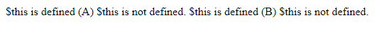

#**Keyword PHP Class**
***

## **A. Penjelasan**

Definisi kelas dasar dimulai dengan kata kunci kelas, diikuti oleh nama kelas, diikuti oleh sepasang kurung kurawal yang menyertakan definisi properti dan metode yang termasuk dalam kelas.

## **B. Bentuk Syntax Umum**

	class nama_kelas{
	
	}
       
## **C. Implementasi**
	<?php
	class A
	{
		function foo()
		{
			if (isset($this)) {
				echo '$this is defined (';
				echo get_class($this);
				echo ")\n";
			} else {
				echo "\$this is not defined.\n";
			}
		}
	}

	class B
	{
		function bar()
		{
			A::foo();
		}
	}
	$a = new A();
	$a->foo();

	A::foo();
	$b = new B();
	$b->bar();

	B::bar();
	?>

			 
* Output

 
