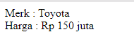

#**Keyword PHP Extends**
***

## **A. Penjelasan**

Extends yaitu syntax yang digunakan untuk membuat pewarisan sifat pada class (inheritance).

## **B. Bentuk Syntax Umum**

       
## **C. Implementasi**

	<?php
	/* class turunan */
	class Harga extends Mobil {
		public $harga;   
		function setHarga($harga){
			$this->harga = $harga;
		}   
		function getHarga(){
			return $this->harga;
		}
	}
	?>

	<?php
	/* mengeksekusi Object */
	$product = new Harga;
	$product->setMerk("Toyota");
	$product->setHarga("Rp 150 juta");

	echo "Merk  : ".$product->getMerk()." ";
	echo "Harga : ".$product->getHarga();

	?>

	<?php
	/* parent class */
	class Mobil {
		public $merk;   
		function setMerk($merk){
			$this->merk = $merk;
		}   
		function getMerk(){
			return $this->merk;
		}
	}
	?>

* Output

 
