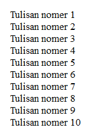

#**Keyword PHP For**
***

## **A. Penjelasan**

For merupakan salah satu bentuk fungsi perulangan, digunakan untuk melaksanakan pernyataan berulang kali terhadap sejumlah nilai yang telah ditetapkan (jumlah putaran harus ditetapkan terllebih dahulu).	

## **B. Bentuk Syntax Umum**

		for (init counter; test counter; increment counter) {
		code to be executed;
		}

## **C. Implementasi**

          <?php 
          for ($a=1;$a<= 10;$x++) {
          echo "The number is". $a." ";
          } 
          ?>

 * Output

 
