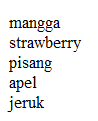

#**Keyword PHP Foreach**
***

## **A. Penjelasan**

Foreach merupakan perintah yang melakukan aksi perulangan data kondisi array yang telah dimasukkan ke dalam variabel yang sudah kita buat.
 
## **B. Bentuk Syntax Umum**

		foreach ($array as $value) {
		code to be executed;
	   }

## **C. Implementasi**

       <?php 
          $a=array("mangga","strawberry","pisang","apel","jeruk");
		  foreach ($a as $hasil){
              echo $hasil." ";
          } 
          ?>
		
		
* Output

 
