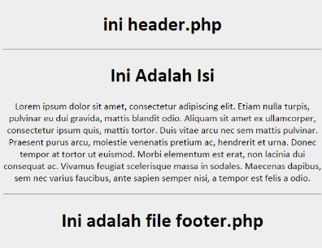

#**Keyword PHP Require**
***

## **A. Penjelasan**

Perintah ini digunakan untuk menggabungkan suatu script PHP atau teks dari file lain dengan script PHP yang memanggilnya. Script atau file  
yang digabung tidak harus berisi script atau kode program PHP. Apabila script atau file yang digabungkan itu berupa script PHP, maka PHP akan mengevaluasi dan menjalankannya.
 
## **B. Bentuk Syntax Umum**

	<?php
	// Panggil file function looping.php
	//dengan require()

	require ("_functtion_looping.php
       
## **C. Implementasi**

     1. Buat file header.php
	
		 <!DOCTYPE html>
	<html>
	<head>
	 <meta charset="utf-8">
	 <title>Contoh Require dan Include</title>
	 <h1>ini header.php</h1>
	 
	</head>
	<body>

	2. Buat file footer.php
	
		<footer>
	  <h1>Ini adalah file footer.php</h1>
	 </footer>
	</body>
	</html>
	
	3. Buat file require.php
	
			<!-- ini file header.php -->
	<?php require('header.php');?>
	

	<!-- ini isi dari file require.php -->
	 <h1>Ini Adalah Isi</h1>
	 
Lorem ipsum dolor sit amet, consectetur adipiscing elit. Etiam nulla turpis, pulvinar eu dui gravida, mattis blandit odio. Aliquam sit amet ex ullamcorper, consectetur ipsum quis, mattis tortor.

	

	<!-- ini file footer.php -->
	<?php require('footer.php');?>

* Output

 
         
