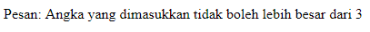

#**Keyword PHP Try**
***

## **A. Penjelasan**

Try yaitu program yang akan dijalankan dan akan ditangkap eksepsinya jika terjadi kesalahan.

## **B. Bentuk Syntax Umum**

       
## **C. Implementasi**

	<?php
		    try {
		    $tes_angka = 4;

		    if($tes_angka > 3) {
	            throw new Exception("Angka yang dimasukkan tidak boleh lebih besar dari 3");
		    };

		    //Jika throw dijalankan, maka tulisan berikut tidak ditampilkan
		    echo 'Jika kamu melihat pesan ini artinya angka yang dimasukkan adalah 3 atau lebih kecil dari 3';
		    } catch(Exception $e) {
		    echo 'Pesan: ' . $e->getMessage();
		    };
	?>

* Output

 
	
