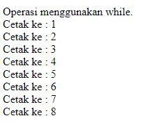

#**Keyword PHP While**
***

## **A. Penjelasan**

Perulangan while banyak digunakan pada program yang terstruktur. Perulangan ini banyak digunakan bila jumlah perulangannya belum diketahui.    
Proses perulangan akan terus berlanjut selama kondisinya bernilai benar (true) dan akan berhenti bila kondisinya bernilai salah atau batas yang ditentukan telah terpenuhi.

## **B. Bentuk Syntax Umum**

		while (condition is true) {
			code to be executed;
		}

## **C. Implementasi**

       <?php
		echo"Operasi menggunakan while.";
		$a=1;
		While($a <= 8)
		{
			echo" Cetak ke : $a ";
			$a++;
		}
		?>

* Output

 
		 
