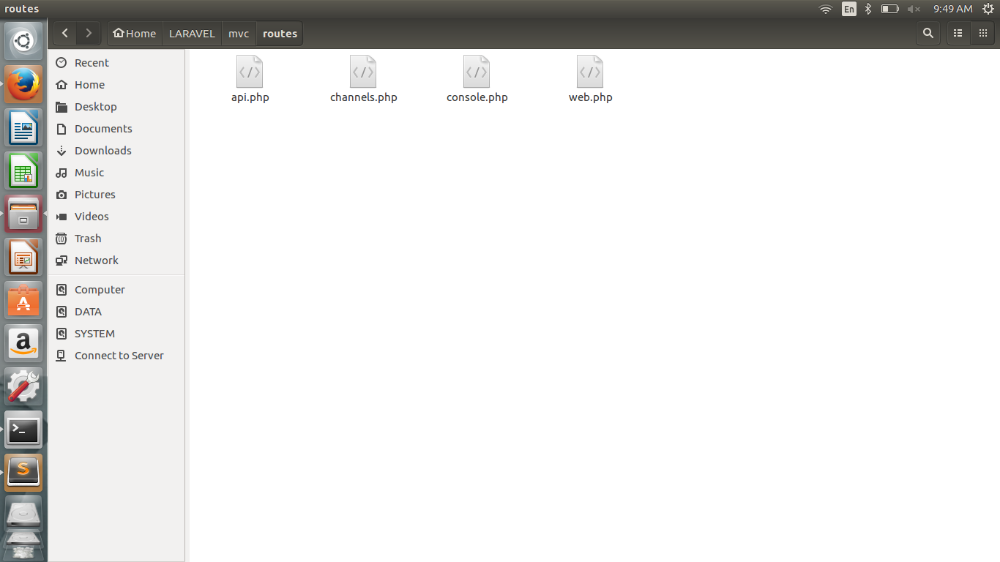
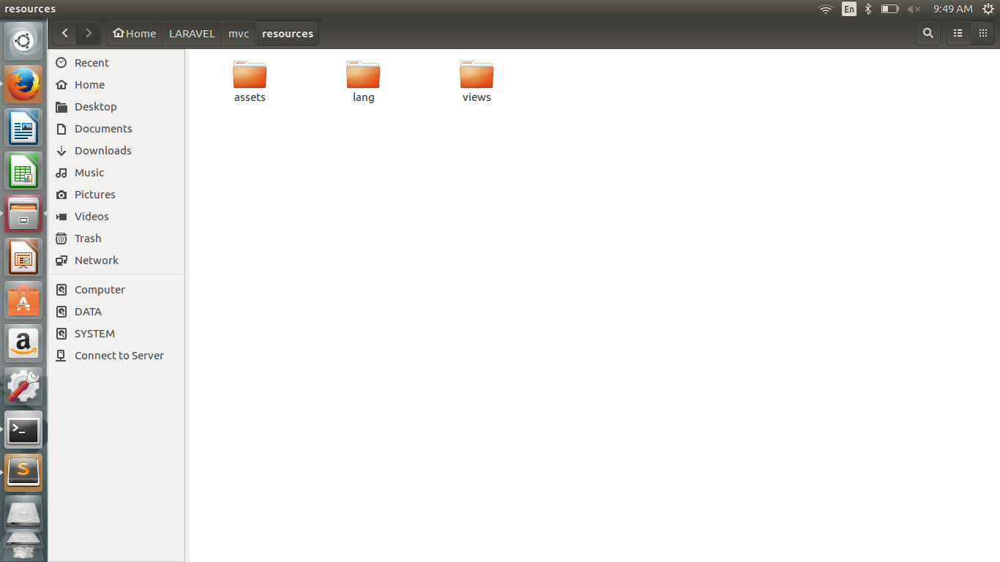
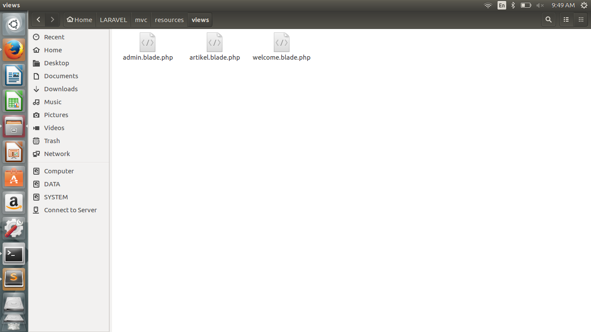
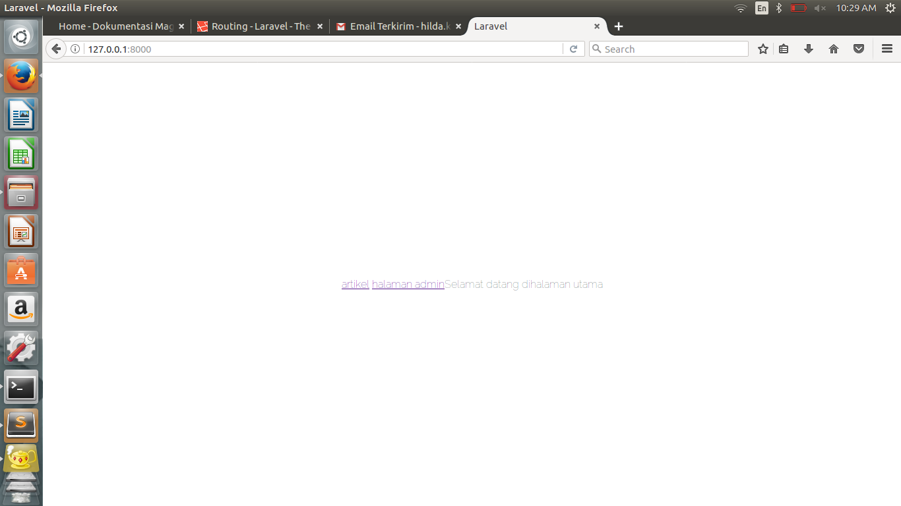
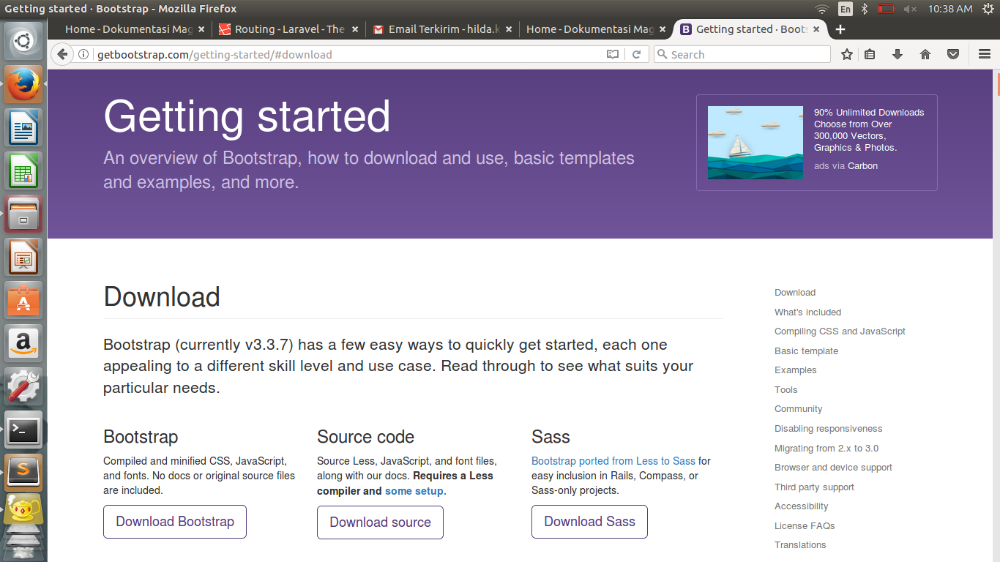
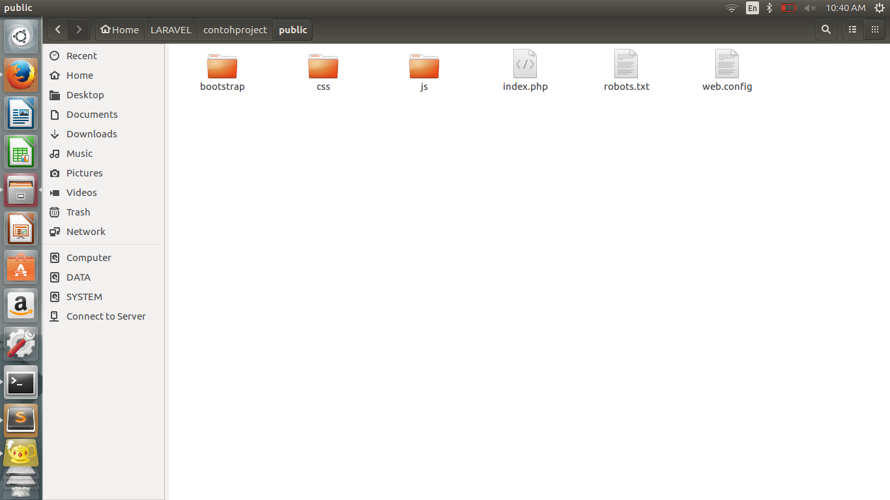
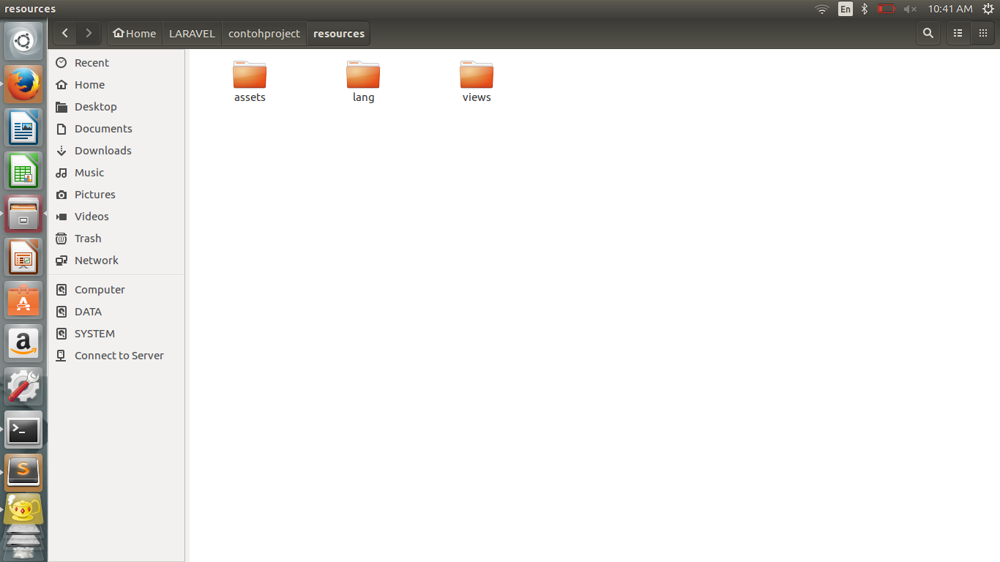

# **Laravel**
***

## **A. Penjelasan**

Kerangka kerja Laravel memiliki beberapa persyaratan sistem. Tentu saja, semua persyaratan ini dipenuhi oleh mesin virtual Laravel Homestead, jadi sangat disarankan agar Anda menggunakan Homestead sebagai lingkungan pengembangan Laravel setempat.

Namun, jika Anda tidak menggunakan Homestead, Anda harus memastikan server Anda memenuhi persyaratan berikut:

     PHP> = 5.6.4
     Ekstensi PHP OpenSSL
     PDO PHP Extension
     Ekstensi PHP Mbstring
     Tokenizer PHP Extension
     Ekstensi PHP XML

***

## **B. Tutorial Install**

### Install laravel
**Tutorial install PHP di Linux Ubuntu 16.04 desktop :**

a. Install Laravel

1. Buka Web Resmi laravel.com 

2. Update seluruh aplikasi
	
		sudo apt-get update

3. Cek versi php
	
		php --version atau php -v //mengetahui versi php

4. Jika Anda tidak menggunakan Homestead, Anda harus memastikan server Anda memenuhi persyaratan berikut:

	     PHP> = 5.6.4
	     Ekstensi PHP OpenSSL
	     PDO PHP Extension
	     Ekstensi PHP Mbstring
	     Tokenizer PHP Extension
	     Ekstensi PHP XML
	
	Lalu cek apakah sudah memenuhi syarat

	* cek openssl, pdo (sudah ada), cek mbstring (belum ada)

			php -m 

			sudo apt-get install php-mbstring
			
	* cek tokenizer (sudah ada), cek php-XML (belum ada)
			
			php -m 
			
			sudo apt-get install php-xml

b. Install Composer

1. Buka link composer

2. Klik download
	
		php -r "copy('https://getcomposer.org/installer', 'composer-setup.php');"
	

		ls -al 
	
		php -r "if (hash_file('SHA384', 'composer-setup.php') === '669656bab3166a7aff8a7506b8cb2d1c292f042046c5a994c43155c0be6190fa0355160742ab2e1c88d40d5be660b410') { echo 'Installer verified'; } else { echo 'Installer corrupt'; unlink('composer-setup.php'); } echo PHP_EOL;"  //installer verivikasi
	
		php composer-setup.php //composer phar
		
		php -r "unlink('composer-setup.php');"
		
		php composer.phar
		
		php composer.phar composer global require "laravel/installer"

3. Buka link composer

4. Klik Getting started

5. Klik global
	
		sudo mv composer.phar /usr/local/bin/composer	
		
		composer
		
		composer create-project --prefer-dist laravel/laravel newProject

c. Mengedit Project

1. Klik kanan folder yg telah dibuat

2. Open with 

3. Other application

4. View all aplication

5. Pilih Teks editor kamu

6. File-open folder

***

## **C. Tutorial Penggunaan**

### Konsep Framework

1. Routes -> web.md

	 

	* web.md

			<?php

			/*
			|--------------------------------------------------------------------------
			| Web Routes
			|--------------------------------------------------------------------------
			|
			| Here is where you can register web routes for your application. These
			| routes are loaded by the RouteServiceProvider within a group which
			| contains the "web" middleware group. Now create something great!
			|
			*/

			Route::get('/', function () {
			    return view('welcome');
			});

			Route::get('/admin', function () {
			    return view('admin');
			});

			Route::get('/artikel', function () {
			    return view('artikel');
			});

2. Resorces -> views 

	 

	 

	* welcome.blade.php

			<!doctype html>
			<html lang="{{ config('app.locale') }}">
			    <head>
			        <meta charset="utf-8">
			        <meta http-equiv="X-UA-Compatible" content="IE=edge">
			        <meta name="viewport" content="width=device-width, initial-scale=1">

			        <title>Laravel</title>

			        <!-- Fonts -->
			        <link href="https://fonts.googleapis.com/css?family=Raleway:100,600" rel="stylesheet" type="text/css">

			        <!-- Styles -->
			        
			    </head>
			    <body>
			        

			            @if (Route::has('login'))
			                

			                    @if (Auth::check())
			                        <a href="{{ url('/home') }}">Home</a>
			                    @else
			                        <a href="{{ url('/login') }}">Login</a>
			                        <a href="{{ url('/register') }}">Register</a>
			                    @endif
			                

			            @endif

			            

			                <a href="artikel">artikel</a>
			                <a href="admin">halaman admin</a>
			            

			            

			                Selamat datang dihalaman utama
			            

			        

			    </body>
			</html>

	* admin.blade.php

			<!doctype html>
			<html lang="{{ config('app.locale') }}">
			    <head>
			        <meta charset="utf-8">
			        <meta http-equiv="X-UA-Compatible" content="IE=edge">
			        <meta name="viewport" content="width=device-width, initial-scale=1">

			        <title>Laravel</title>

			        <!-- Fonts -->
			        <link href="https://fonts.googleapis.com/css?family=Raleway:100,600" rel="stylesheet" type="text/css">

			        <!-- Styles -->
			        
			    </head>
			    <body>
			        

			            @if (Route::has('login'))
			                

			                    @if (Auth::check())
			                        <a href="{{ url('/home') }}">Home</a>
			                    @else
			                        <a href="{{ url('/login') }}">Login</a>
			                        <a href="{{ url('/register') }}">Register</a>
			                    @endif
			                

			            @endif

			            

			                <a href="artikel">artikel</a>
			                <a href="admin">halaman admin</a>
			            

			            

			                Selamat datang dihalaman admin
			            

			        

			    </body>
			</html>

	* artikel.blade.php

			<!doctype html>
			<html lang="{{ config('app.locale') }}">
			    <head>
			        <meta charset="utf-8">
			        <meta http-equiv="X-UA-Compatible" content="IE=edge">
			        <meta name="viewport" content="width=device-width, initial-scale=1">

			        <title>Laravel</title>

			        <!-- Fonts -->
			        <link href="https://fonts.googleapis.com/css?family=Raleway:100,600" rel="stylesheet" type="text/css">

			        <!-- Styles -->
			        
			    </head>
			    <body>
			        

			            @if (Route::has('login'))
			                

			                    @if (Auth::check())
			                        <a href="{{ url('/home') }}">Home</a>
			                    @else
			                        <a href="{{ url('/login') }}">Login</a>
			                        <a href="{{ url('/register') }}">Register</a>
			                    @endif
			                

			            @endif

			            

			                <a href="artikel">artikel</a>
			                <a href="admin">halaman admin</a>
			            

			            

			                Selamat datang dihalaman artikel
			            

			        

			    </body>
			</html>

3. Output

	 

### Templating

1.  Download bootstrap

	 

2. Public 

	 

2. Resorces -> views 

	 

