# **Linux Ubuntu**
***

## **A. Penjelasan**

Ubuntu adalah salah satu distribusi Linux yang berbasiskan pada Debian dan memiliki interface desktop. 
***

## **B. Tutorial Installasi**

### Install Ubuntu di Virtual Box
**Tutorial install Linux Ubuntu 16.04 desktop dengan virtual box :**

1. Setelah kita selesai menginstall Virtual Box,langkah selanjutnya adalah menginstall Linux Ubuntu pada Virtual Box.Klik icon New dan akan tampil seperti digambar.Ketikkan Linux pada Name dan pilih version Linux nya

2. Langkah berikutnya mengatur ukuran memori dan klik next/lanjut.
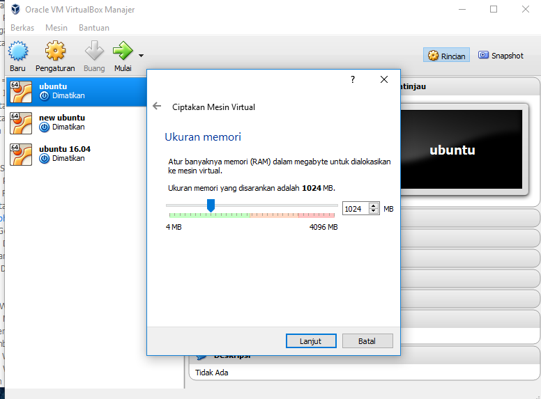

3. Lalu pilih penyimpanan hardisk dan klik buat
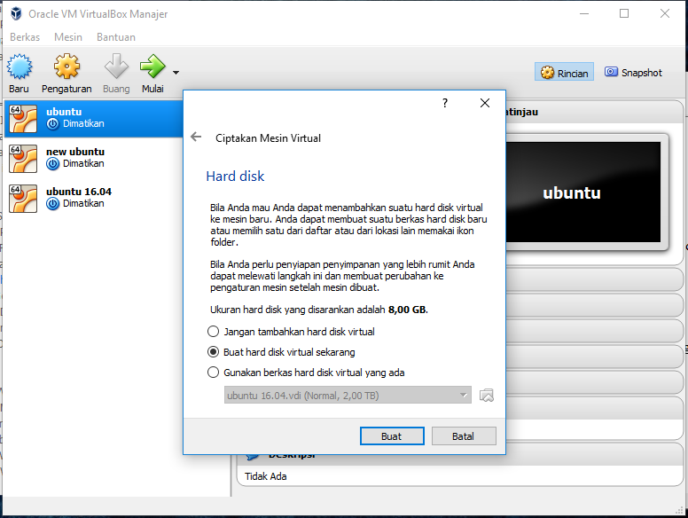

4. Pilih tipe hard disk seperti pada gambar dan klik next/lanjut
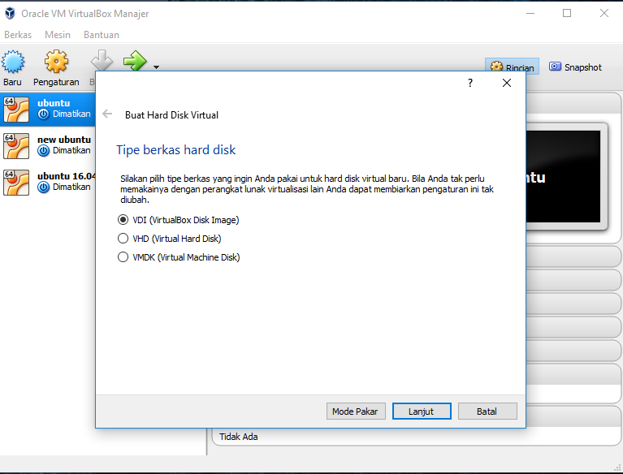

5. Pada penyimpanan hard disk fisik pilih yang dialokasikan secara dinamik
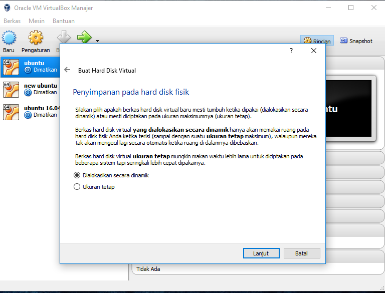

6. Pilih ukuran berkas dan klik buat
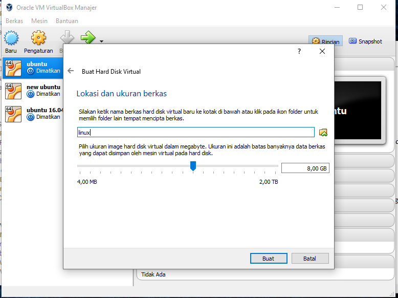

7. Memproses tampilan Ubuntu
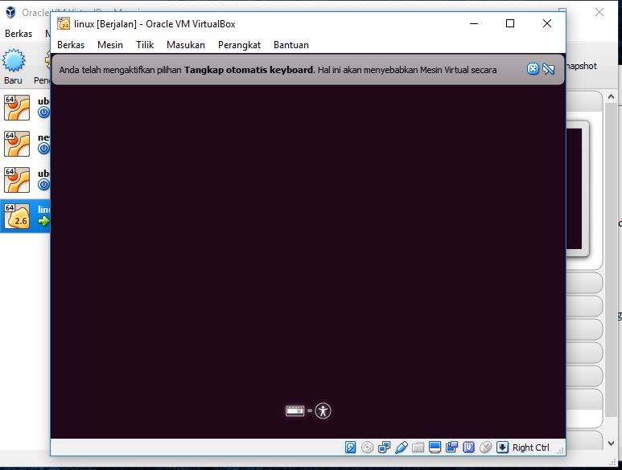

8. Dan inilah tampilan Linux Ubuntu
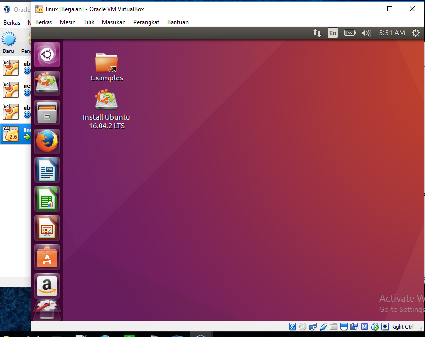

### Install Ubuntu di Windows
**Tutorial install Linux Ubuntu 16.04 desktop dual boot dengan windows :**

1. Saat anda masih berada pada Desktop Windows 7, tugas anda adalah membuat ruang kosong pada Hardisk di partisi C/System untuk tempat instalasi OS Ubuntu, caranya ialah klik Start --> Computer --> Manage.                                                   
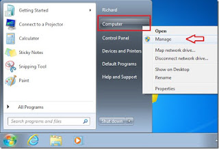

2. Selanjutnya pilih Disk Management --> klik kanan pada partisi System/C lalu pilih Shrink Volume...                                        
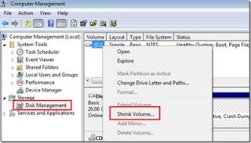

3. Sebagai Contoh, Saya mebuat ruang kosong dengan ukuran/kapasitas 8156MB atau sekitar 8GB, jika anda sudah menetapkan besar ukuran untuk ruang kosong yang anda akan gunakan, maka silahkan klik Shrink.                                                                                        
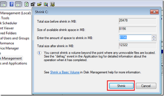

4. Setelah proses pembuatan ruang kosong untuk installasi Ubuntu selesai, maka yang harus anda sediakan adalah CD/DVD ubuntu bisa juga menggunakan USB Flashdisk, tapi untuk USB Flashdisk, caranya sedikit berbeda dengan artikel yang saya tulis ini, mungkin anda bisa menyesuaikannya,untuk cara pembuatan anda bisa lihat di situs resmi ubuntu. untuk Membuat CD/DVD untuk USB Flashdisk atau jika anda belum memiliki file installernya bisa download aplikasi instalisasi menggunakan CD/DVD / USB Flashdisk . Jika CD/DVD /USB Flashdisk sudah tersedia, maka anda bisa melanjutkan dengan me-restart PC/Laptop anda. Jangan Lupa Masukkan CD/DVD ke room dan setting boot dari CD/DVD.

Jika anda behasil masuk, maka akan ada tampilan seperti gambar di bawah ini lalu pilih bahasa yang akan anda gunakan selama menginstall.       

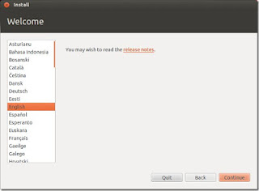

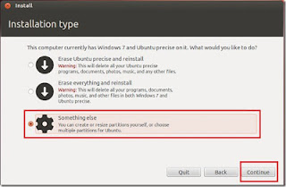

Pilih Something Else dan Klik Continue

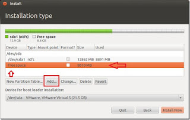

Selanjutnya pilih Free Space dan klik add.. untuk membuat ruang swap

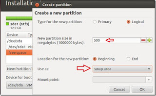

Tentukan size untuk ruang swap yang akan dibuat, sebagai contoh saya menggunakan 500/500MB. Pada pilihan Use as pilih Swap area --> OK

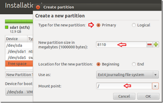

Untuk tahap selanjutnya, klik add lagi untuk membuat partisi ubuntu. untuk kali ini kita menggunakan semua sisa size pada ruang kosong. Dan untuk pilihan Use as pilih ext4 journaling file system, sedangkan untuk Mount point tambahkan / (garis miring). Jika semua tahap sudah selesai tekan OK

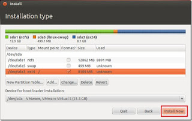

Untuk tahap ini tinggal menekan tombol Install Now dan ikuti langkah-langkah install-nya hingga selesai.