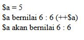
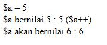
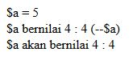
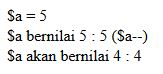

# **Increment**
***

## **A. Penjelasan**
Pada tutorial kali ini saya akan membahas macam-macam operator yang ada didalam PHP terutama operator Increment dan Decrement. Fungsi kedua operator tersebuat adalah untuk mempersingkat pembuatan kode program. Increment dan Decrement adalah nama untuk operasi seperti $a++ dan $a--. Increment digunakan untuk menambah nilai variable sebanyak 1 angka, sedangkan Decrement digunakan untuk mengurang nilai variable sebanyak 1 angka. Cara penulisannya menggunakan tanda tambah sebanyak 2 kali untuk Increment, sedangkan Decrement menggunakan tanda kurang 2 kali dan untuk penempatan kedua tanda tersebut boleh sebelum variable atau sesudah variable tetapi dari penempatan keduannya tersebut memiliki perbedaan sehingga terdapat 4 jenis Increment dan Decrement dalam PHP. Penjelasannya sebagai berikut :
***

## **B. Bentuk Syntax Umum**

		1)	++$a Pre-increment : menambahkan nilai $a sebanyak 1, lalu kirim nilai.
		2)	$a++ Post-increment : kirim nilai $a, lalu menambahkan nilai $a sebanyak 1.
		3)	--$a Pre-decrement : mengurangi nilai $a sebanyak 1, lalu kirim nilai.
		4)	$a-- Post- decrement: kirim nilai $a, lalu mengurangi nilai $a sebanyak 1.
***

## **C. Implementasi**
### Contoh Case 1
a. Pre Increment

* Source Code                                  
		
		<?php

		//Pre-increment

		$a = 5;

		echo "\$a = $a  ";
		echo "\$a bernilai 6 : " . ++$a . "($a\++)  ";
		echo "\$a bernilai 6 : " . $a . " ";

		?> 

* Output                                  
 

b. Post Increment 

* Source Code                                  

		<?php

		//Pre-increment

		$a = 5;

		echo "\$a = $a  ";
		echo "\$a bernilai 5 : " . ++$a . "(\++$a)  ";
		echo "\$a bernilai 6 : " . $a . " ";

		?> 
* Output                                  
 

c. Pre Decrement 

* Source Code                                  

		<?php

		//Pre-decrement

		$a = 5;

		echo "\$a = $a  ";
		echo "\$a bernilai 4 : " . --$a . "(--/$a)  ";
		echo "\$a bernilai 4 : " . $a . " ";

		?>  

* Output                                  
 

d. Post Decrement 

* Source Code                                  

		<?php

		//Pre-decrement

		$a = 5;

		echo "\$a = $a  ";
		echo "\$a bernilai 5 : " . --$a . "(\$a--)  ";
		echo "\$a bernilai 4 : " . $a . " ";

		?>  
* Output                                  
 
***

### Contoh Case 2

* Source Code  

		<?php
		$jumlah_pesan = 0;

		function tambah_pesan_1(){
			$GLOBALS['jumlah_pesan'] += 1;
		}

		function tambah_pesan_2(){
			return 1;
		}

		tambah_pesan_1();
		tambah_pesan_1();
		tambah_pesan_1();
		tambah_pesan_1();

		echo $jumlah_pesan;
		?> 

* Output                                                  
 

* Implementasi Increment :

	tambah_pesan_1 () sebanyak 4 kali 
	dengan echo $jumlah_pesan berarti memanggil nilai mulai dari 0 sebanyak 4 kali. Hasilnya adalah “4”

* Implementasi Prosedur dan Fungsi :

	tambah_pesan_1 = Prosedur
	tambah_pesan_2 = Fungsi
***

### Contoh Case 3

* Source Code                       

		<?php
		$jumlah_pesan = 0;

		function tambah_pesan_1(){
			$GLOBALS['jumlah_pesan'] += 1;
		}

		function tambah_pesan_2(){
			return 1;
		}

		tambah_pesan_1();
		tambah_pesan_1();
		tambah_pesan_1();
		tambah_pesan_1();

		$jumlah_pesan = $jumlah_pesan + tambah_pesan_2();
		$jumlah_pesan = $jumlah_pesan + tambah_pesan_2();
		$jumlah_pesan = $jumlah_pesan + tambah_pesan_2();

		echo $jumlah_pesan
		?>

* Output                                                                               
 

* Implementasi Increment :

	tambah_pesan_1 () sebanyak 4 kali dan penambahan tambah_pesan_2 () sebanyak 3 kali dengan echo $jumlah_pesan berarti memanggil nilai mulai dari 0 sebanyak 4 kali dan dengan echo $jumlah_pesan berarti memanggil nilai mulai dari 0 sebanyak 3 kali  Hasilnya adalah “7”

* Implementasi Prosedur dan Fungsi :

	tambah_pesan_1 = Prosedur
	tambah_pesan_2 = Fungsi
***

### Contoh Case 4

* Source Code        

		<?php
		$jumlah_pesan = 0;

		function tambah_pesan_1(){
			$GLOBALS['jumlah_pesan'] += 1;
		}

		function tambah_pesan_2(){
			return 1;
		}

		tambah_pesan_1();
		tambah_pesan_1();
		tambah_pesan_1();
		tambah_pesan_1();

		$jumlah_pesan += tambah_pesan_2();
		$jumlah_pesan += tambah_pesan_2();
		$jumlah_pesan += tambah_pesan_2();

		echo $jumlah_pesan
		?>

* Output                                                  
 

* Implementasi Increment :

	tambah_pesan_1 () sebanyak 4 kali dan penambahan tambah_pesan_2 () sebanyak 3 kali dengan echo $jumlah_pesan berarti memanggil nilai mulai dari 0 sebanyak 4 kali dan dengan echo $jumlah_pesan berarti memanggil nilai mulai dari 0 sebanyak 3 kali  Hasilnya adalah “7”

* Implementasi Prosedur dan Fungsi :

	tambah_pesan_1 = Prosedur
	tambah_pesan_2 = Fungsi
***

### Contoh Case 5

* Source Code

		<?php
		$jumlah_pesan = 0;

		function tambah_pesan_1(){
			$GLOBALS['jumlah_pesan'] += 1;
		}

		function tambah_pesan_2(){
		        $GLOBALS['jumlah_pesan'] += 1;
			return 1;
		}

		tambah_pesan_1();
		tambah_pesan_1();
		tambah_pesan_1();
		tambah_pesan_1();

		tambah_pesan_2();
		tambah_pesan_2();
		tambah_pesan_2();

		echo $jumlah_pesan
		?>

* Output  
 

* Implementasi Increment :

	tambah_pesan_1 () sebanyak 4 kali dan penambahan tambah_pesan_2 () sebanyak 3 kali dengan echo $jumlah_pesan berarti memanggil nilai mulai dari 0 sebanyak 4 kali dan dengan echo $jumlah_pesan berarti memanggil nilai mulai dari 0 sebanyak 3 kali  Hasilnya adalah “7”

* Implementasi Prosedur dan Fungsi :

	tambah_pesan_1 = Prosedur
	tambah_pesan_2 = Fungsi
