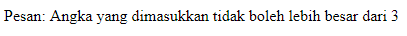

#**Keyword PHP Catch**
***

## **A. Penjelasan**

Catch yaitu berfungsi untuk melihat apakah function yang dieksekusi terjadi kesalahan atau error atau tidak. jika terjadi kesalahan maka akan di catch.Dan  catch akan  menunjukan error yang ingin kita beritahukan.

## **B. Bentuk Syntax Umum**

       try {

} catch (ExceptionType name) {

} catch (ExceptionType name) {

}

## **C. Implementasi**
	<?php
	try {
	$tes_angka = 4;

	if($tes_angka > 3) {
	throw new Exception("Angka yang dimasukkan tidak boleh lebih besar dari 3");
	};

	//Jika throw dijalankan, maka tulisan berikut tidak ditampilkan
	echo 'Jika kamu melihat pesan ini artinya angka yang dimasukkan adalah 3 atau lebih kecil dari 3';
	} catch(Exception $e) {
	echo 'Pesan: ' . $e->getMessage();
	};
	?>

* Output

 
	
