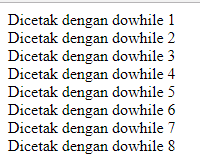

#**Keyword PHP Do While**
***

## **A. Penjelasan**

Do While digunakan untuk menjalankan suatu pernyataan lalu diuji apakah kondisi sudah bernilai benar, tapi jika bernilai salah maka pernyataan tidak dijalankan. Pada dasarnya perulangan do...while sama saja dengan perulangan while, hanya saja pada proses perulangan dengan while, seleksi berada di while yang letaknya di atas sementara pada perulangan do...while, seleksi while berada di bawah batas perulangan.Jadi dengan menggunakan struktur do...while sekurang-kurangnya akan terjadi satu kali perulangan.
 
## **B. Bentuk Syntax Umum**

         do {
          code to be executed;
         } while (condition is true);

## **C. Implementasi**

        <?php
		$a=1;
		do 
		{echo"Dicetak dengan dowhile $a  ";
		$a++;
		}while($a <=  8)
		?>

* Output

 
