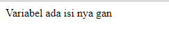

#**Keyword PHP Isset**
***

## **A. Penjelasan**

Isset digunakan untuk menyatakan variabel yang sudah diset ataupun tidak. Jika variabel sudah diset maka variavel akan mengembalikan nilai true, sebaliknya akan bernilai false(memesan tempat di memori)

## **B. Bentuk Syntax Umum**

       
## **C. Implementasi**

	<?php 
	 //memeriksa suatu varible ada atau tidak  
	 $orang = "";  
	 if (isset($orang)){  
	      echo "Variabel ada isi nya gan";  
	      }else{  
		   echo " Variabel Nggak ada isi nya";  
		   }  
	 // fungsi isset mengecek ada variable nya gan  
	 // coba ganti $orang yg di dalem kurung ganti $orangx  
	 // nilai yg jadi FALSE (false itu yg bawah)  
	 ?>
		 
* Output

