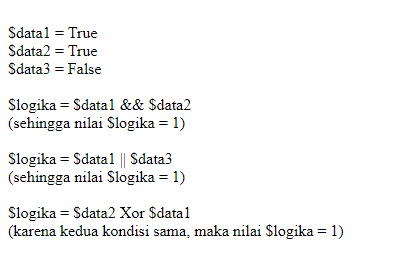

#**Keyword PHP Isset**
***

## **A. Penjelasan**

OR akan menghasilkan nilai benar jika kedua kondisi pembanding bernilai benar, juga akan bernilai benar meskipun salah satu pembanding bernilai benar / satu

## **B. Bentuk Syntax Umum**
	
	$a or $b = BENAR jika salah satu $a atau $b adalah TRUE.
       
## **C. Implementasi**

	<?php
		echo " ";
		$data1 = true;
		$data2 = true;
		$data3 = false;
		echo ("\$data1 = True ");
		echo ("\$data2 = True ");
		echo ("\$data3 = False  ");
		$logika = $data1 && $data2;
		echo ("\$logika = \$data1 && \$data2  ")  ;
		printf ( "(sehingga nilai \$logika = %d)   ", $logika);
		$logika = $data1 || $data3;
		echo ("\$logika = \$data1 || \$data3  ")   ;
		printf ( " (sehingga nilai \$logika = %d)   ", $logika);
		$logika = $data2 Xor $data1;
		echo ("\$logika = \$data2 Xor  \$data1  ")  ;
		printf (" (karena kedua kondisi sama, maka nilai \$logika = %d)   ",      
		$logika);
		$data1 = !$data;
		echo ("! \$data1  ");
		printf (" (setelah nilai \$data1 dikenai logika NOT (!), sehingga nilai    
		\$data1 = %d)", $data1);
	?>

* Output

 
