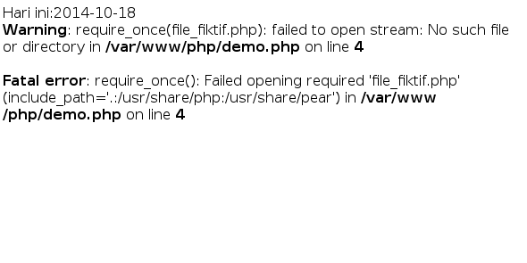

#**Keyword PHP Require_Once**
***

## **A. Penjelasan**

Pada prinsipnya require_once() sama dengan require() akan tetapi perbedaannya adalah dengan menggunakan require_once(), maka jika terjadi duplikasi nama atau pemanggilan suatu nama fungsi dapat dihindari. PHP dapat dipaksa untuk menggunakan nama fungsi yang telah ada sebelumnya pada include() atau require() yang pertama.

## **B. Bentuk Syntax Umum**

	require_once("nama_file_beserta_path");  
	atau  
	require_once "nama_file_beserta_path";  

       
## **C. Implementasi**

	<?php   
	 require_once('contoh_require_once.php');   
	 require_once('contoh_require_once.php');   
	 require_once('file_fiktif.php');   
	 echo "script dibawah file fiktif";  
	?>  
	
* Output

 

    
