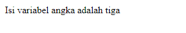

#**Keyword PHP Switch**
***

## **A. Penjelasan**

Switch yaitu sebuah stuktur percabangan yang akan memeriksa suatu variabel, lalu menjalankan perintah-perintah yang sesuai dengan kondisi yang mungkin terjadi untuk variabel tersebut.

## **B. Bentuk Syntax Umum**

	<?php 
	switch (variable) 
	{ 
		case 'nilai1': 
			# pernyataan... 
			break; 
		case 'nilai2': 
			# pernyataan... 
			break; 
		default: 
			# pernyataan... 
			break; 
	} 
	?>
       
## **C. Implementasi**

	<?php 
	$angka = 3;
	switch ($angka) {
		case 1:
			echo "Isi variabel angka adalah satu";
			break;
		case 2:
			echo "Isi variabel angka adalah dua";
			break;
		case 3:
			echo "Isi variabel angka adalah tiga";
			break;
		case 4:
			echo "Isi variabel angka adalah empat";
			break;
		case 5:
			echo "Isi variabel angka adalah lima";
			break;
		case 6:
			echo "Isi variabel angka adalah enam";
			break;
		default:
			echo "Isi variabel tidak di temukan";
			break;
	}
	?>

* Output

 
        
