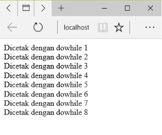

# **Do While**
***

## **A. Penjelasan**
Perulangan while dan do-while pada dasarnya hampir sama. Perbedaan terletak pada ’lokasi’ pengecekan kondisi perulangan. Namun pada perulangan do-while, pengecekan kondisi akan dilakukan di akhir perulangan, sehingga walaupun kondisi adalah FALSE, perulangan akan tetap berjalan minimal 1 kali.
***

## **B. Bentuk Syntax Umum**
	
	do 
	{
	 statement-yang-diulang;
	 counter;
	} while (kondisi); 
***

## **C. Implementasi**
### Contoh Case 

**1. Perulangan Do While**

	<?php
	$a=1;
	Do
	{echo"Dicetak dengan dowhile $a  ";
	$a++;
	}while($a <=  8)
	?>

* Output

 