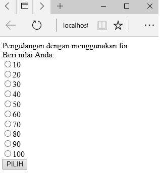

# **For**
***

## **A. Penjelasan**
Perulangan suatu baris kode
***

## **B. Bentuk Syntax Umum**
	
	for (Kondisi_awal, kondisi, counter) 
	{
	 statement-yang-diulang;
	} 
***

## **C. Implementasi**
### Contoh Case 

**1. Perulangan For**

	<?php
	echo"Pengulangan dengan menggunakan for 
	<form method=\"POST\" action=\"kirim.php\">
	Beri nilai Anda: ";
	For($a=10;$a<=100;$a+=10)
	{
	  echo"<input type=\"radio\" value=\"$a\" name=\"R1\">$a ";
	}
	?>
	<input type="submit" value="PILIH" name="pilih">
	</form>

* Output

 