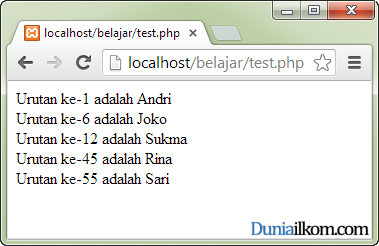

# **Foreach**
***

## **A. Penjelasan**
Perulangan foreach merupakan perulangan khusus untuk pembacaan nilai array. 
Setiap array memiliki pasangan key dan value. Key adalah ‘posisi’ dariarray, dan value adalah ‘isi’ dari array.
***

## **B. Bentuk Syntax Umum**
	
	foreach ($nama_array as $key => $value)
	{
	    statement ($key...$value...)
	}
***

## **C. Implementasi**
### Contoh Case 

**1. Perulangan Foreach**

	<?php
	$nama = array(
	        1=>"Andri",
	        6=>"Joko",
	        12=>"Sukma",
	        45=>"Rina",
	        55=>"Sari");
	 
	foreach ($nama as $kunci =>$isi)
	{
	   echo "Urutan ke-$kunci adalah $isi";
	   echo " ";
	}
	?>

* Output

 