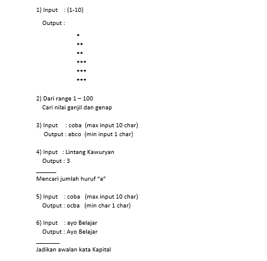
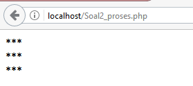
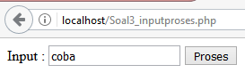
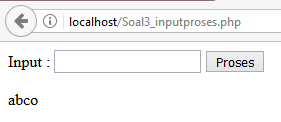
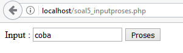
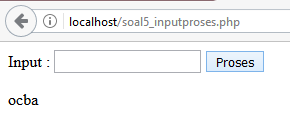

# **Looping**
***

## **A. Penjelasan**
Perulangan data atau yang biasa disebut dengan “looping” adalah proses yang dilakukan secara berulang-ulang sampai batas yang ditentukan.

Macam-macam looping :

 Looping      			|
------------------------|
 [for](for.md) 			| 
 [while](while.md)      | 
 [do while](doWhile.md) |
 [foreach](foreach.md)  |

a. FOR

Perulangan suatu baris kode.

b. WHILE

Perulangan dalam suatu kondisi yang bernilai TRUE untuk kondisi perulangan dimana banyaknya perulangan tidak dapat dipastikan pada saat penulisan program.

c. DO WHILE

Perulangan while dan do-while pada dasarnya hampir sama. Perbedaan terletak pada ’lokasi’ pengecekan kondisi perulangan. Namun pada perulangan do-while, pengecekan kondisi akan dilakukan di akhir perulangan, sehingga walaupun kondisi adalah FALSE, perulangan akan tetap berjalan minimal 1 kali.

d. FOREACH

Perulangan foreach merupakan perulangan khusus untuk pembacaan nilai array. 
Setiap array memiliki pasangan key dan value. Key adalah ‘posisi’ dariarray, dan value adalah ‘isi’ dari array.
***

## **B. Implementasi**
### Contoh Case 

* Soal dan Penyelesaian :

 

**1. Penyelesaian**

Soal1_input.php

	<html>
	<head>
		<title>Soal 1</title>
	</head>
	<body>
	<form action="Soal1_proses.php" method="post">
		Masukkan Angka 1 - 10: <input type="text" name="angka"> 
		<input type="submit">
	</form>
	</body>
	</html>

Soal1_proses.php

	<html>
	<head>
		<title></title>
	</head>
	<body>

	<?php 
	$nilai=$_POST["angka"];

	for ($i=0; $i<$nilai; $i++)
	{
   		for ($j=0; $j <$nilai; $j++)
   		{
      		echo '*';
   		}
   	echo " ";
	}
	?> 

	</body>
	</html>

* Output

Form Input              

 

Form Proses 

 

**3. Penyelesaian **

	<form method="post">
	Input : <input type="text" name="kalimat">
	<input type="submit" value="Proses"> 
	</form>

	<?php

	function urutkan($a, $b) { 
	  if(ord($a) ==  ord($b))
	  { 
	     return 0;
	  } 
	  return (ord($a) < ord($b)) ? -1 : 1;
	}

	$kalimat = $_POST["kalimat"];
	$listChar = str_split($kalimat);
	usort($listChar,'urutkan');

	foreach ($listChar as $char) {
	   echo $char;
	}

	?>

* Output

Form Input Proses

  

**4. Penyelesaian **

	<form action="soal4_inputproses.php" method="GET">
	<tr>
		<td>Input</td>
		<td>:</td>
		<td><input type="text" name="teks" value="<?php echo $_GET[teks]; ?>"></td>
	</tr> 
	<td colspan="2" align="center"><input type="submit" name="submit" value="Proses"></td>
	</tr>
	</form>

	<?php
	if ($_GET[submit]=="Proses")

		//$kalimat="Lintang Kawuryan";
		$a=strlen($_GET["teks"]);

		for($i=0;$i<=$a;$i++)
		{
			if($_GET["teks"][$i]=='a')
			{
				$voc=$voc+1;
			}
			else
			{
				continue;
			}
		}

		echo "Input : $_GET[teks]";
		echo "  Jumlah huruf a : $voc";

	?>

**5. Penyelesaian**

	<form method="post">
	Input : <input type="text" name="kalimat">
	<input type="submit" value="Proses"> 
	</form>

	<?php

	function urutkan($a, $b) { 
	  if(ord($a) ==  ord($b))
	  { 
	     return 0;
	  } 
	  return (ord($a) < ord($b)) ? -1 : 1;
	}

	$kalimat = $_POST["kalimat"];
	$listChar = str_split($kalimat);
	usort($listChar,'urutkan');

	foreach ($listChar as $char) {
	   echo $char;
	}

	?>

* Output

Form Input

Form Proses

**6. Penyelesaian**

	<table>
	<form action="soal6_inputproses.php" method="GET">
		<tr>
			<td>Kalimat</td>
			<td>:</td>
			<td><input type="text" name="teks" value="<?php echo $_GET[teks];?>"></td>
		</tr> 
		<tr>
			<td colspan="2" align="center"><input type="submit" name="submit" value="Proses"></td>
		</tr>
	</form>
	</table>

	<?php
	if ($_GET[submit]=="Proses")
	{
		$hasil=($_GEt[teks]);
		//perulangan dan proses

		$pisah=explode(" ", $hasil);
		foreach ($pisah as $data) {
			echo strtoupper(substr($data, 0, 1));
			echo substr($data, 1, 20). " ";
		}
	}
	?>
