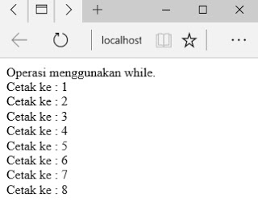

# **While**
***

## **A. Penjelasan**
Perulangan dalam suatu kondisi yang bernilai TRUE untuk kondisi perulangan dimana banyaknya perulangan tidak dapat dipastikan pada saat penulisan program.
***

## **B. Bentuk Syntax Umum**
	
	while (kondisi) 
	{
	 statement-yang-diulang;
	 counter;
	} 
***

## **C. Implementasi**
### Contoh Case 

**1. Perulangan While**

	<?php
	echo"Operasi menggunakan while.";
	$a=1;
	While($a <= 8)
	    {
	        echo" Cetak ke : $a ";
	        $a++;
	    }
	?>

* Output

 