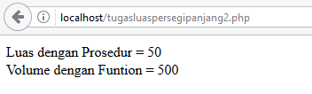
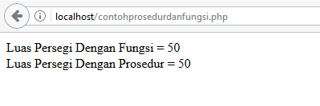

# **Prosedur dan Fungsi**
***

## **A. Penjelasan**
a. Prosedur                                                                                                                                  
Prosedur adalah bagian dari suatu program yang disusun secara terpisah untuk melakukan suatu tugas khusus atau fungsi tertentu. 

Pada dasarnya ada dua macam bentuk prosedur yaitu Subrutin (subprogram) dan Fungsi.

1. Subrutin (subprogram) adalah bagian dari program yang dibuat terpisah untuk melaksanakan sebagian dari tugas yang harus diselesaikan oleh suatu program. Pada umumnya yang dikenal dengan nama “Prosedur” sebenarnya adalah “Subprogram” .

2. Fungsi adalah bagian dari program yang dibuat terpisah untuk melaksanakan fungsi tertentu yang menghasilkan suatu nilai untuk dikembalikan ke program utama.

Prosedur banyak digunakan pada program yang terstruktur karena :

1. Merupakan penerapan konsep program Modular, yaitu memecah-mecah program yang rumit menjadi program-program bagian yang lebih sederhana dalam bentuk sebagai prosedur-prosedur.

2. Untuk hal-hal yang sering dilakukan berulang-ulang, cukup dituliskan sekali saja dalam prosedur dan dapat dipanggil atau dipergunakan sewaktu-waktu bila diperlukan.

3. Membuat kode program lebih mudah dibaca.

4.	Dapat digunakan untuk menyembunyikan detil program

Prosedur memiliki ciri-ciri sebagai berikut ini :
	
1. Hanya memiliki satu fungsi tujuan (logical inherent). Sebuah prosedur sebaiknya hanya memiliki satu fungsi tujuan dan tidak bercampur dengan tujuan lain. Hal ini untuk membuat prosedur lebih focus.

2. Berukuran kecil (small size). Yang dimaksud ukuran disini adalah panjang algoritma atau panjang kode program pada suatu prosedur. Ukuran kecil akan mudah dibaca maupun diperbaiki.

3. Tidak tergantung pada prosedur lain (independent). Sebuah prosedur harusnya bersifat mandiri, artinya sebuah prosedur dapat berjalan dan diuji tanpa menunggu bagian lainnya selesai. Selain itu variable yang digunakan dalam prosedur tidak mempengaruhi variabel yang digunakan pada bagian lain di keseluruhan program.

Manfaat pembuatan prosedur :

1. Modularisasi : Suatu program yang besar dan kompleks dapat dibagi ke dalam beberapa prosedur sehingga setiap prosedur merupakan bagian yang mudah dikerjakan. Dengan demikian, program besar tersebut menjadi mungkin diselesaikan.

2. Simplifikasi : Dalam suatu program, sering diperlukan suatu tugas yang harus dikerjakan berulang-ulang dengan nilai-nilai variabel yang berbeda. Agar tidak merepotkan maka tugas ini cukup ditulis sekali saja dalam bentuk prosedur yang kemudian dipanggil berulang-ulang sesuai kebutuhan.

b. Fungsi                                                                                                          
Fungsi sama seperti halnya dengan prosedur, namun tetap ada perbedaannya yaitu fungsi mempunyai output dengan tipe variabel yang kita tentukan. Berbeda dengan procedure yang bisa dengan tidak menggunakan parameter, fungsi harus menggunakan parameter dalam penggunaannya. Fungsi juga mempunyai Output dengan tipe variabel yang kita tentukan. 

c. Perbedaan Prosedur dan Fungsi                                                              
 

Perbedaan Prosedur dan Fungsi

1. Pada fungsi, nilai yang dikirimkan balik terdapat pada nama fungsinya (kalau pada prosedur pada parameter yang dikirimkan secara acuan).

2. Karena nilai balik berada di nama fungsi tersebut, maka fungsi tersebut dapat langsung digunakan untuk dicetak hasilnya. Atau nilai fungsi tersebut dapat juga langsung dipindahkan ke pengenal variable yang lainnya.

3. Nama Prosedur tidak dapat digunakan lagsung tidak seperti pada Nama Fungsi, yang dapat langsung digunakan dari sebuah prosedur adalah parameternya yang mengandung nilai balik.

4. Pada dasarnya tidak ada perbedaan yang signifikan antara prosedur dan fungsi pada Bahasa C, hanya dibedakan dari return value. Jika suatu sub program tersebut memiliki nilai balik (return value) maka sub program tersebut disebut Function (Fungsi) jika tidak memiliki nilai balik maka sub program tersebut merupakan prosedure (Procedure)

d. Manfaat Menggunakan Prosedur dan Fungsi

1. Dapat memecahkan program yang rumit dan besar menjadi program-program yang lebih sederhana atau kecil.

2. Untuk aktivitas yang dilakukan lebih dari satu kali / sering dilakukan berulang-ulang.

3. Meningkatkan kemampuan untuk menganalisis kesalahan, jika terjadi suatu kesalahan kita tinggal mencari fungsi atau prosedur yang bersangkutan saja dan tak perlu di seluruh program.

e. Keuntungan Menggunakan Prosedur dan Fungsi

Keuntungan menggunakan Prosedur, yaitu :

1. Merupakan penerapan konsep program modular, yaitu memecah-mecah program yang rumit menjadi program-program bagian yang lebih sederhana dalam bentuk prosedur-prosedur.

2. Untuk hal-hal yang sering dilakukan berulang-ulang, cukup dituliskan sekali saja dalam prosedur dan dapat dipanggil atau dipergunakan sewaktu-waktu bila diperlukan.

Keuntungan menggunakan Fungsi, yaitu

1. Menguraikan tugas pemrograman rumit menjadi langkah-langkah yang lebih sederhana atau kecil.

2. Mengurangi duplikasi kode (kode yang sama ditulis berulang-ulang) dalam program.

3. Dapat menggunakan kode yang ditulis dalam berbagai program yang berbeda.

4. Memecah program besar menjadi kecil sehingga dapat dikerjakan oleh programmer-programmer atau dipecah menjadi beberapa tahap sehingga mempermudah pengerjaan dalam sebuah projek

5. Menyembunyikan informasi dari user sehingga mencegah adanya perbuatan iseng seperti memodifikasi atau mengubah program yang kita buat

6. Meningkatkan kemampuan pelacakan kesalahan, jika terjadi suatu kesalahan kita tinggal mencari fungsi yang bersangkutan saja dan tak perlu mencari kesalahan tersebut di seluruh program

f. Mengapa Menggunakan Prosedur dan Fungsi

1. Memecahkan program yang rumit dan besar menjadi program-program yang lebih sederhana atau kecil.

2. Untuk aktivitas yang dilakukan lebih dari satu kali / sering dilakukan berulang-ulang.

3. Meningkatkan kemampuan untuk menganalisis kesalahan, jika terjadi suatu kesalahan kita tinggal mencari fungsi atau prosedur yang bersangkutan saja dan tak perlu di seluruh program.
***

## **B. Bentuk Syntax Umum**

a. Prosedur

Bentuk umum prosedur adalah sebagai berikut:

	Void NamaProsedur (DaftarParameter)
	{
	/*Code atau Badan Prosedur*/
	}

Contoh prsedur dalam Bahasa C:
	 

	#include <stdio.h>
	//Prosedur
	void main(int panjang){// dimisalkan int panjang sebagai parameter input
	int lebar, luas; //deklarasi variable dengan tipe data integer
	panjang = 16;
	printf(“Masukkan Lebar Persegi: “);//menampilkan tulisan
	scanf(“%d”,&lebar);//menyimpan nilai
	luas=(panjang*lebar); //rumus luas persegi panjang
	printf(“Luas persegi panjang tersebut adalah : %d\n\n”,luas);
	lus=main2(21);//fungsi main2 dapat dipanggil disini karena memiliki nilai return
	printf(“Luas persegi panjang tersebut ke2 adalah : %d\n\n”,luas);
	}

b. Fungsi

Bentuk umum prosedur adalah sebagai berikut:

	TipeData NamaFungsi (DaftarParameter){
	/*Code atau Badan Prosedur*/
	return nilaireturn;
	}

Contoh Fungsi dalam Bahasa C:
	 

	#include <stdio.h>
	//Fungsi
	int main(int panjang){
	int lebar, luas;
	printf(“Masukkan Lebar Persegi ke2: “);
	scanf(“%d”,&lebar);
	luas=(panjang*lebar);
	return luas;
	} 
***

## **C. Implementasi**
### Contoh Case 1

**1. Contoh menghitung luas persegi menggunakan Prosedur dan Fungsi dengan Bahasa c++**

a. Prosedur 

* Source Code

		#include <iostream>

		using namespace std;

		int main(int argc, char *argv[])
		{
			//variabel dengan tipe int dan float
			int s1,s2;
			float luas_persegi;
					   
			//input dan output   
			cout<<"=============================================\n"<<endl;
			cout<<"   Menghitung Luas Persegi dengan Prosedur\n"<<endl;
			cout<<"=============================================\n"<<endl;
			cout<<"  Masukan Nilai Sisi Pertama ( s1 ) : ";cin>>s1;
			cout<<"  Masukan Nilai Sisi Kedua   ( s2 ) : ";cin>>s2;
					    
			//rumus
			luas_persegi=s1*s2;
					   
			//tampilan output dan hasil   
			cout<<endl;
			cout<<"============================================="<<endl;
			cout<<"\n";
			cout<<"  Luas persegi dengan Sisi Pertama "<<s1<<" dan Sisi Kedua "<<s2<<" adalah "<<luas_persegi;
			cout<<endl<<endl;
		}

* Output dengan inputan
 

	
b. Fungsi

* Source Code

		#include<iostream>

		using namespace std;

		//nilai 
		int Luas(int x,int y)
		{
			int hasil;
			hasil =x*y;
			return  hasil ;
		}

		main()
		{  
			//variabel dengan tipe int
			int s1=0,s2=0,hasil;

			//input dan output   
			cout<<"===========================================\n"<<endl;
			cout<<"   Menghitung Luas Persegi dengan Fungsi\n"<<endl;
			cout<<"===========================================\n"<<endl;
			cout<<"  Masukan Nilai Sisi Pertama ( s1 ) : ";cin>>s1;
			cout<<"  Masukan Nilai Sisi Kedua   ( s2 ) : ";cin>>s2;
					   
			//rumus dan pengembalian nilai
			hasil=Luas(s1,s2);
					    
			//tampilan output dan hasilnya
			cout<<"\n";
			cout<<"==========================================="<<endl;
			cout<<"\n";
			cout<<"  Luas persegi dengan Sisi Pertama "<<s1<<" dan Sisi Kedua "<<s2<<" adalah "<<hasil;
			cout<<"\n";
		} 

* Output dengan inputan
 
***

### Contoh Case 2

* Tugas :
	-	Clas luas_persegi
	-	Memiliki 2 method luas dan volume
	-	Tanpa Inputan
	-	Tanpa atribut
	-	Menghitung luas dengan prosedur
	-	Menghitung volume dengan function
	-	Panjang = 5
	-	Lebar = 10
		
* Source Code
	
		<?php
		//class luas persegi
			Class Luas_Persegi{

				//memiliki 2 method yaitu Volume dan Luas
				function Luas($panjang, $lebar){
					echo "Luas dengan Prosedur = " . ($panjang * $lebar);
				}

				function Volume($panjang, $lebar, $tinggi){
					$volume = $panjang*$lebar*$tinggi;
					return $volume; //respon nilai
				}
			}

			//objek dari persegi panjang
			$persegi = new Luas_Persegi();

			//implementasi Prosedur
			$persegi->Luas(10,5);
			echo " ";

			//implementasi Function
			$volume = $persegi->Volume(10,5,10); 
			echo "Volume dengan Funtion = " . $volume; 
		?>

* Output dengan inputan                        
 
***

### Contoh Case 3

* Soal :
	- Menghitung luas persegi panjang dengan Prosedur 
	- Dalam 1 sourcecode
	- Tidak ada inputan langsung menampilkan nilai

* Ciri – ciri :
	- Terdiri dari 2 method yaitu "Luas" dan "Volume" 
	- Variabel panjang dan lebar dan tinggi
	- Tanpa Class
	- Luas = Implementasi Prosedur, karena tidak ada pengembalian nilai
	- Volume = Implementasi Prosedur, karena tidak ada pengembalian nilai

* Source Code                                                              

		<?php
			function Volume($panjang, $lebar, $tinggi)
			{
				$volume = $panjang*$lebar*$tinggi;
				echo "Volume dengan Prosedur = " . $volume;
			}

			function Luas($panjang, $lebar)
			{
				$luas = $panjang*$lebar;
				echo "Luas dengan Prosedur = " . $luas;
			}

			Volume(10,5,10);
			echo " ";
			Luas(10,5);
		?>

* Output dengan inputan                        
 
***

### Contoh Case 4

* Soal :
	- Menghitung luas persegi panjang dengan Prosedur 
	- Dengan class
	- Dalam 1 sourcecode
	- Tidak ada inputan langsung menampilkan nilai

* Ciri – ciri :
	- Terdiri dari 2 method yaitu "Luas" dan "Volume" 
	- Variabel panjang dan lebar dan tinggi
	- Tanpa Class
	- Luas = Implementasi Prosedur, karena tidak ada pengembalian nilai
	- Volume = Implementasi Prosedur, karena tidak ada pengembalian nilai

* Source Code                                                              

		<?php
		Class Luas_Persegi{
			function Volume($panjang, $lebar, $tinggi){
				$volume = $panjang*$lebar*$tinggi;
				echo "Volume dengan Prosedur = " . $volume;
			}

			function Luas($panjang, $lebar){
				$luas = $panjang*$lebar;
				echo "Luas dengan Prosedur = " . $luas;
			}
		}

		$persegi = new Luas_Persegi();
		$persegi->Volume(10,5,10);
		echo " ";
		$persegi->Luas(10,5);
		?>

* Output dengan inputan                        
 
***

### Contoh Case 5

* Soal :
	- Menghitung luas persegi panjang dengan 2 cara yaitu prosedur dan fungsi 
	- Dalam 1 sourcecode
	- Tidak ada inputan langsung menampilkan nilai

* Ciri – ciri :
	-Terdiri dari 2 method yaitu “luas1” dan “luas2” 
	- Variabel panjang dan lebar
	- Tanpa Class
	- “luas1” = Implementasi Fungsi, karena ada pengembalian nilai
	- “luas2” = Implementasi Prosedur, karena tidak ada pengembalian nilai

* Source Code                                                              

		<?php
		function luas1($panjang,$lebar){
		    return $panjang * $lebar;
		}

		function luas2($panjang,$lebar){
		    echo "Luas Persegi Dengan Prosedur = " . ($panjang * $lebar);
		}

		/* implementasi function */
		$hasil = luas1(10,5);
		echo "Luas Persegi Dengan Fungsi = " . $hasil;
		echo " ";

		/* implementasi procedure */
		luas2(10,5);
		?>

* Output dengan inputan                        
 
