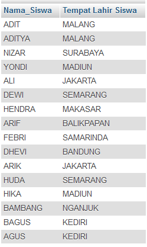
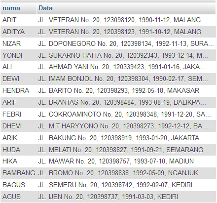

# **SQL Alias**
***

## **A. Penjelasan** 
Alias SQL digunakan untuk memberi tabel, atau kolom dalam sebuah tabel, nama sementara.
Alias sering digunakan untuk membuat nama kolom lebih mudah dibaca.
Sebuah alias hanya ada selama queri.

Alias bisa bermanfaat bila :

* Ada lebih dari satu tabel yang terlibat dalam queri
* Fungsi yang digunakan dalam queri
* Nama kolom besar atau tidak terlalu mudah dibaca
* Dua atau lebih kolom digabungkan bersama
***

## **B. Bentuk Syntax Umum**

Syntax Alias Kolom

		SELECT nama_kolom AS nama_alias_kolom
		FROM nama_tabel;

Syntax Alias Tabel 

		SELECT nama_kolom(s)
		FROM nama_tabel AS nama_alias_tabel;
***

## **C. Implementasi** 
### Contoh Case 
* Desaigner Database :

		Database = db_magang_2
 

* Soal dan Penyelesaian :

Alias Kolom

**1. Menampilkan data dengan kolom (nama siswa, tempat lahir siswa)**

**NOTE : nama dengan keteranagn Nama_Siswa dan tempat lahir dengan keterangan Tempat_lahir_siswa**

		SELECT nama AS Nama_Siswa, tempat_lahir AS Tempat_Lahir_Siswa
		FROM siswa;

* Output                         

**2. Menampilkan data dengan kolom (nama siswa, tempat lahir siswa)**

**NOTE : kolom (nama siswa) dengan keteranagn Nama_Siswa dan kolom (tempat lahir siswa) dengan keterangan Tempat Lahir Siswa**

		SELECT nama AS Nama_Siswa, tempat_lahir AS 'Tempat Lahir Siswa'
		FROM siswa;

* Output                         

**3. Menampilkan data dengan kolom (nama siswa, alamat siswa, nisn siswa, tanggal lahir siswa, tempat lahir siswa)**

**NOTE : kolom (alamat siswa, nisn siswa, tanggal lahir siswa, tempat lahir siswa) dengan keterangan Data**

		SELECT nama, CONCAT(alamat,', ',nisn,', ',tanggal_lahir,', ',tempat_lahir) AS Data
		FROM siswa;

* Output                         

Alias Tabel

**Menampilkan data dengan kolom (nama siswa, agama siswa)**

**NOTE : tabel (siswa) dengan keterangan s dan tabel (agama) dengan keterangan a**

		SELECT s.nama, a.nama
		FROM siswa AS s, agama AS a
		WHERE s.nama='ADIT' AND a.id=s.id_agama; 

* Output                         
