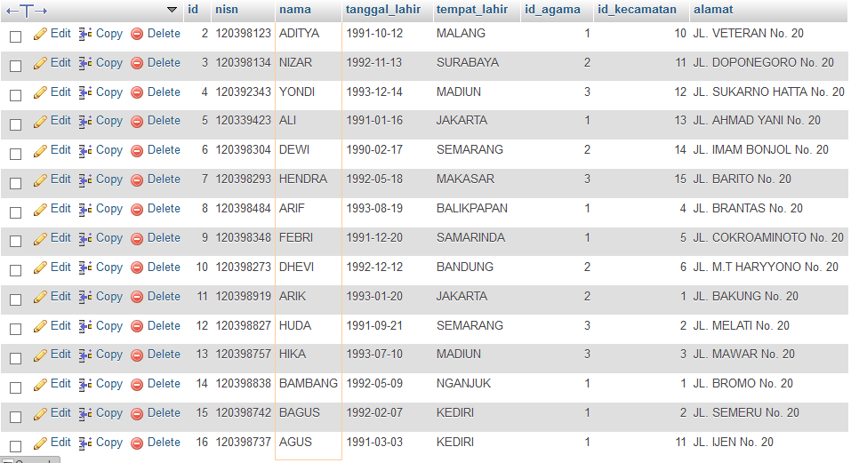

# **SQL And, Or, Not**
***

## **A. Penjelasan**
Klausa WHERE dapat digabungkan dengan operator AND, OR, dan NOT.

Operator AND dan OR digunakan untuk menyaring catatan berdasarkan lebih dari satu kondisi:

* Operator AND menampilkan catatan jika semua kondisi dipisahkan oleh DAN BENAR.
* Operator OR menampilkan catatan jika ada kondisi yang dipisahkan oleh ATAU BENAR.

Operator NOT menampilkan catatan jika kondisinya TIDAK BENAR.
***

## **B. Bentuk Syntax Umum**

And Syntax

		SELECT kolom1, kolom2, ...
		FROM nama_tabel
		WHERE kondisi1 AND kondisi2 AND kondisi3 ...;

Or Syntax

		SELECT kolom1, kolom2, ...
		FROM nama_tabel
		WHERE kondisi1 OR kondisi2 OR kondisi3 ...;

Not Syntax

		SELECT column1, column2, ...
		FROM table_name
		WHERE NOT condition;
***

## **C. Implementasi** 
### Contoh Case 
* Desaigner Database :

		Database = db_magang_2
 

* Soal dan Penyelesaian :

And Syntax

**Menampilkan data dengan kolom (nama siswa = ADIT yang tempat lahirnya di MALANG)**

		SELECT * FROM siswa
		WHERE nama='ADIT' AND tempat_lahir='MALANG';  

* Output 
 

Or Syntax

**Menampilkan data dengan kolom (nama siswa = ADIT atau yang tempat lahirnya di SURABAYA)**

		SELECT * FROM siswa
		WHERE nama='ADIT' OR tempat_lahir='SURABAYA'; 

* Output 
 

Not Syntax

**Menampilkan data dengan selain kolom (nama siswa = ADIT)**

		SELECT * FROM siswa
		WHERE NOT nama='ADIT'; 

* Output 

Kombinasi AND, OR and NOT

**1. Menampilkan data dengan kolom (nama siswa = ADIT yang tempat lahirnya di MALANG atau di SURABAYA)**

		SELECT * FROM siswa
		WHERE nama='ADIT' AND (tempat_lahir='MALANG' OR tempat_lahir='SURABAYA');

* Output 

**2. Menampilkan data dengan selain kolom (nama siswa = ADIT atau yang tidak tempat lahirnya di SURABAYA)**

		SELECT * FROM siswa
		WHERE NOT nama='ADIT' AND NOT tempat_lahir='SURABAYA';

* Output 
