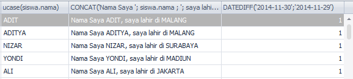
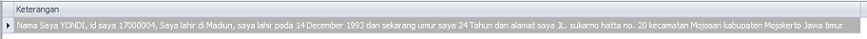

# **SQL Fungsi**
***

## **A. Penjelasan**
a. SQL Fungsi Agregasi

SQL Fungsi Agregasi adalah untuk mengembalikan satu nilai, dihitung dari nilai dalam kolom.

|    Fungsi   |   Kegunaan                                              | Contoh
|------------ | ------------------------------------------------------- | ----------------------------------------------------- |
|   AVG()     | untuk mencari rata-rata nilai 							| SELECT AVG(harga) AS Harga_rata2 FROM order			|
|   COUNT()   | untuk menghitung jumlah record (baris) 					| SELECT COUNT(id) AS Jumlah_tamu FROM bukutamu 		|
|   MAX()     | untuk mencari nilai terakhir 							| SELECT MAX(harga) AS Harga_termahal FROM order        |
|   MIN()     | untuk mencari nilai terkecil 							| SELECT MIN(harga) AS Harga_termurah FROM order        |
|   ROUND()   | untuk membulatkan angka ke jumlah digit yang ditentukan | SELECT no_mhs,ROUND(nilai,0)as nilai bulat FROM nilai |
|   SUM()     | untuk menghitung penjumlahan data                       | SELECT SUM(harga) AS Harga_total FROM order           |

**b. SQL Fungsi String**

| Fungsi   		 	  | Kegunaan                                               	  | COntoh
|-------------------- | ----------------------------------------------------------| -----------------------------------------------|
| CONCAT()  		  | untuk menghitung jumlah record (baris) 					  | SELECT CONCAT('Dan', 'Morgan') FROM dual       |
| LEFT()   			  | untuk mengambil nilai dari suatu string dari posisi kiri  | SELECT Nm_brg, Left(Nm_brg,2)                  |
| LEN() / LENGTH()    | untuk menghitung panjang string  						  | SELECT LEN(nama) as panjang_nama FROM bukutamu |
| LOWER() / LCASE()   | untuk merubah string menjadi huruf kecil seluruhnya       | SELECT LCASE(nama) as Nama FROM bukutamu       |
| LTRIM()     		  | untuk memotong suatu karakter pada sebelah kiri   	      | SELECT LTRIM(' Dan Morgan ') FROM dual         |
| SUBSTRING() / MID() | untuk mengambil nilai suatu string dari arah kiri         | SELECT MID (kota,1,4) as singkatan_kota FROM   |
| REPLACE()     	  | untuk mengganti karakter / memotong string 				  | SELECT REPLACE(‘www.google.com’, ‘w’, ‘WW’)    |
| RIGHT()     		  | untuk mengambil nilai dari suatu string dari posisi kanan |	SELECT Nm_brg, Right(Nm_brg,2)                 |
| RTRIM()     		  | untuk memotong suatu karakter pada sebelah kanan   	      | SELECT RTRIM(' Dan Morgan ') FROM dual         |
| UPPER() / UCASE()   | untuk merubah string menjadi huruf kapital seluruhnya     | SELECT UCASE(nama) as Nama FROM bukutamu       |

***
## **B. Implementasi**
### Contoh Case 

* Desaigner Database :

		Database = db_magang_2
 

* Soal dan Penyelesaian :

Source Code (Contoh Soal)

		SELECT siswa.id, siswa.nama, LEFT(siswa.nama, 3) , RIGHT(siswa.nama, 3) , 
		SUBSTRING(siswa.nama, 2, 2) ,LENGTH (siswa.nama) , LPAD(siswa.nama, 10, 'x') , 
		LPAD(siswa.id, 10, '0') , lcase(siswa.nama) , ucase(siswa.nama), 
		CONCAT('Nama Saya ', siswa.nama , ', saya lahir di ', tempat_lahir) , 
		DATEDIFF('2014-11-30','2014-11-29') 
		FROM siswa			

* Output
 

**Soal : Outputnya dalam 1 kolom yang bernama Keterangan**

		nama kolom as Keterangan
		"Nama saya YONDI , id saya 17000001, Saya lahir di Nganjuk , 
		saya lahir pada 26 October 1995 dan 
		sekarang umur saya 29 Tahun dan alamat saya JL. Diponegoro no 26 
		kecamatan Wilangan kabupaten Nganjuk Jawa Timur "

* Jawaban Source Code 1 (Menampilkan seluruh data)
		
		SELECT CONCAT('Nama Saya ', UCASE(siswa.nama), ', id saya ', SUBSTRING(NOW(), 3, 2), LPAD(siswa.id, 6, '0'), ', Saya lahir di ', UCASE(SUBSTRING(siswa.tempat_lahir, 1,1)), LCASE(SUBSTRING(siswa.tempat_lahir, 2)), ', saya lahir pada ', DATE_FORMAT(siswa.tanggal_lahir, '%d %M %Y'), ' dan sekarang umur saya ', 
		(YEAR(NOW()) - YEAR(tanggal_lahir)) , ' Tahun dan alamat saya ' ,UCASE(SUBSTRING(siswa.alamat, 1,4)),LCASE(SUBSTRING(siswa.alamat, 5)) , ' kecamatan ', 
		UCASE(SUBSTRING(kecamatan.nama, 1,1)), LCASE(SUBSTRING(kecamatan.nama, 2)) , ' kabupaten ', UCASE(SUBSTRING(kabupaten.nama, 1,1)),
		LCASE(SUBSTRING(kabupaten.nama, 2)), ' ', UCASE(SUBSTRING(provinsi.nama, 1,1)), LCASE(SUBSTRING(provinsi.nama, 2)) ) AS Keterangan 
		FROM siswa, kecamatan, kabupaten, provinsi 
		WHERE siswa.id_kecamatan = kecamatan.id 
		AND kecamatan.id_kabupaten = kabupaten.id 
		AND kabupaten.id_provinsi = provinsi.id

	* Output :                                                                    

* Jawaban Source Code 2 (Hanya menampilkan data Yondi sesuai Tugas)
		
		SELECT CONCAT('Nama Saya ', UCASE(siswa.nama), ', id saya ', SUBSTRING(NOW(), 3, 2), LPAD(siswa.id, 6, '0'), ', Saya lahir di ', UCASE(SUBSTRING(siswa.tempat_lahir, 1,1)), LCASE(SUBSTRING(siswa.tempat_lahir, 2)), ', saya lahir pada ', DATE_FORMAT(siswa.tanggal_lahir, '%d %M %Y'), ' dan sekarang umur saya ', 
		(YEAR(NOW()) - YEAR(tanggal_lahir)) , ' Tahun dan alamat saya ' ,UCASE(SUBSTRING(siswa.alamat, 1,4)), LCASE(SUBSTRING(siswa.alamat, 5)) , ' kecamatan ', 
		UCASE(SUBSTRING(kecamatan.nama, 1,1)), LCASE(SUBSTRING(kecamatan.nama, 2)) , ' kabupaten ', UCASE(SUBSTRING(kabupaten.nama, 1,1)), LCASE(SUBSTRING(kabupaten.nama, 2)), ' ', UCASE(SUBSTRING(provinsi.nama, 1,1)), LCASE(SUBSTRING(provinsi.nama, 2)) ) AS Keterangan 
		FROM siswa, kecamatan, kabupaten, provinsi 
		WHERE siswa.id_kecamatan = kecamatan.id 
		AND kecamatan.id_kabupaten = kabupaten.id 
		AND kabupaten.id_provinsi = provinsi.id
		AND siswa.nama = 'YONDI'

	* Output :

