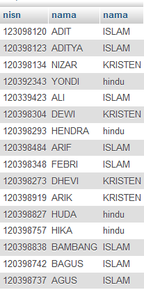
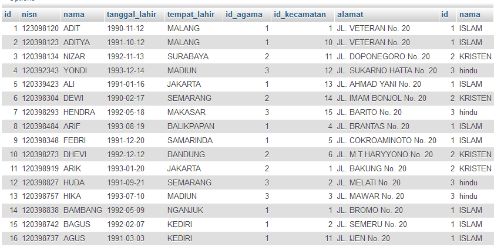
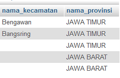

# **SQL Inner Join**
***

## **A. Penjelasan**
SQL Inner Join adalah Bentuk kondisi join dimana di antara 2 atau lebih tabel yang ingin di join memiliki hubungan sehingga semua isi tabel yang di pilih bisa di tampilkan

***

## **B. Bentuk Syntax Umum**
* Join dengan 2 tabel

		SELECT nama_kolom(s)
		FROM tabel1,tabel2 
		WHERE tabel1.nama_kolom = tabel2.nama_kolom;

		atau 

		SELECT nama_kolom(s)
		FROM tabel1 INNER JOIN tabel2 
		ON tabel1.nama_kolom = tabel2.nama_kolom;

* Join dengan 3 tabel

		SELECT nama_kolom(s)
		FROM tabel1, tabel2, tabel3
		WHERE tabel1.nama_kolom = tabel2.nama_kolom
		AND tabel2.nama_kolom = tabel3.nama_kolom;

		atau 

		SELECT nama_kolom(s)
		FROM ((tabel1 INNER JOIN tabel2 ON tabel1.nama_kolom = tabel2.nama_kolom)
		INNER JOIN tabel3 ON tabel2.nama_kolom = tabel3.nama_kolom);
***

## **C. Implementasi**
### Contoh Case 1 
* Desaigner Database :

		Database = db_magang_2
 

* Soal dan Penyelesaian :

**a) SQL Join Tabel**                    

Join Tabel dalam 2 tabel

**1. Menampilkan seluruh data pada tabel siswa dan tabel agama** 

		SELECT * 
		FROM siswa, agama 
		WHERE siswa.id_agama=agama.id;

* Output                         
 

**2. Menampilkan data dengan kolom (nisn siswa, nama siswa, nama agama)** 

		SELECT siswa.nisn, siswa.nama, agama.nama
		FROM siswa, agama
		WHERE siswa.id_agama=agama.id;

* Output                         
 

Join Tabel dalam 3 tabel

**Menampilkan data dengan kolom (nama siswa, nama mata pelajaran, nilai angka)**  

		SELECT siswa.nama,mata_pelajaran.nama, nilai_mata_pelajaran.nilai_angka
		FROM siswa, mata_pelajaran, nilai_mata_pelajaran
		WHERE siswa.id=nilai_mata_pelajaran.id_siswa
		AND nilai_mata_pelajaran.id_mata_pelajaran=mata_pelajaran.id

* Output                         
 

**b) SQL Inner Join**

Inner Join dalam 2 tabel

**1. Menampilkan seluruh data pada tabel siswa dan tabel agama** 

		SELECT * 	
		FROM siswa INNER JOIN agama 
		ON siswa.id_agama=agama.id;

* Output                         
 

**2. Menampilkan data dengan kolom (nisn siswa, nama siswa, nama agama)** 

		SELECT siswa.nisn, siswa.nama, agama.nama
		FROM siswa INNER JOIN agama
		ON siswa.id_agama=agama.id;

* Output                         
 

Inner Join dalam 3 tabel

**Menampilkan data dengan kolom (nama siswa, nama mata pelajaran, nilai angka)** 

		SELECT siswa.nama,mata_pelajaran.nama, nilai_mata_pelajaran.nilai_angka
		FROM ((siswa INNER JOIN nilai_mata_pelajaran ON siswa.id=nilai_mata_pelajaran.id_siswa)
		INNER JOIN mata_pelajaran ON nilai_mata_pelajaran.id_mata_pelajaran=mata_pelajaran.id);

* Output                         
 
***

### Contoh Case 2 
* Desaigner Database :

		Database = ukk_11102016_sbd_153140914111007_hildakhairunnisa
 

* Soal dan Penyelesaian :

**a) SQL Join Tabel**                    

Join Tabel dalam 2 tabel

**1. Menampilkan seluruh data pada tabel dokter dan tabel spesialis** 

		SELECT * 
		FROM tb_dokter, tb_spesialis 
		WHERE tb_spesialis.KD_SPESIALIS = tb_dokter.KD_SPESIALIS;

* Output                         
  

**2. Menampilkan data dengan kolom (nama dokter, jam mulai jaga dan jam selesai jaga)** 

		SELECT tb_dokter.NAMA_DOKTER, tb_jaga.JAM_MULAI, tb_jaga.JAM_SELESAI
		FROM tb_dokter, tb_jaga
		WHERE tb_dokter.KD_DOKTER=tb_jaga.KD_DOKTER;

* Output                         
 

Join Tabel dalam 3 tabel

**Menampilkan data dengan kolom (nama dokter, nama spesialis, jam mulai jaga, jam selesai jaga)**  

		SELECT tb_dokter.NAMA_DOKTER, tb_spesialis.SPESIALIS, tb_jaga.JAM_MULAI, tb_jaga.JAM_SELESAI
		FROM tb_dokter, tb_spesialis, tb_jaga
		WHERE tb_dokter.KD_SPESIALIS=tb_spesialis.KD_SPESIALIS
		AND tb_dokter.KD_DOKTER=tb_jaga.KD_DOKTER;

* Output                         
 

**b) SQL Inner Join**

Inner Join dalam 2 tabel

**1. Menampilkan seluruh data pada tabel dokter dan tabel spesialis** 

		SELECT * 	
		FROM tb_dokter INNER JOIN tb_spesialis 
		ON tb_spesialis.KD_SPESIALIS = tb_dokter.KD_SPESIALIS;

* Output                         
 

**2. Menampilkan data dengan kolom (nama dokter, jam mulai jaga dan jam selesai jaga)**  

		SELECT tb_dokter.NAMA_DOKTER, tb_jaga.JAM_MULAI, tb_jaga.JAM_SELESAI
		FROM tb_dokter INNER JOIn tb_jaga
		ON tb_dokter.KD_DOKTER=tb_jaga.KD_DOKTER;

* Output                         
 

Inner Join dalam 3 tabel

**Menampilkan data dengan kolom (nama dokter, nama spesialis, jam mulai jaga, jam selesai jaga)**

		SELECT tb_dokter.NAMA_DOKTER, tb_spesialis.SPESIALIS, tb_jaga.JAM_MULAI, tb_jaga.JAM_SELESAI
		FROM ((tb_dokter INNER JOIN tb_spesialis ON tb_dokter.KD_SPESIALIS = tb_spesialis.KD_SPESIALIS)
		INNER JOIN tb_jaga ON tb_dokter.KD_DOKTER = tb_jaga.KD_DOKTER);

* Output                         
  
***

### Contoh Case 3
* Desaigner Database :

		Database = db_magang_1
 

* Soal dan Jawaban case :

**1. Menampilkan data dengan kolom (nama kecamatan, nama kabupaten)** 

		SELECT kecamatan.nama_kecamatan,kabupaten.nama_kabupaten
		FROM kecamatan,kabupaten
		WHERE kecamatan.id_kabupaten=kabupaten.id_kabupaten

		atau

		SELECT x.nama_kecamatan,y.nama_kabupaten
		FROM kecamatan x,kabupaten y
		WHERE x.id_kabupaten=y.id_kabupaten

		atau

		SELECT kecamatan.nama_kecamatan,kabupaten.nama_kabupaten
		FROM kecamatan INNER JOIN kabupaten
		ON (kecamatan.id_kabupaten=kabupaten.id_kabupaten)

* Output                         
 

**2. Menampilkan data dengan kolom (nama kecamatan, nama kabupaten, nama provinsinya)**

		SELECT kecamatan.nama_kecamatan,kabupaten.nama_kabupaten, provinsi.nama_provinsi
		FROM kecamatan, kabupaten, provinsi
		WHERE kecamatan.id_kabupaten=kabupaten.id_kabupaten AND kabupaten.id_provinsi=provinsi.id_provinsi

* Output                         
 

**3. Menampilkan data dengan kolom (nama kecamatan, nama provinsinya)** 

		SELECT kecamatan.nama_kecamatan, provinsi.nama_provinsi
		FROM kecamatan, kabupaten, provinsi
		WHERE kecamatan.id_kabupaten=kabupaten.id_kabupaten AND kabupaten.id_provinsi=provinsi.id_provinsi

* Output                         
  
***

### Contoh Case 4
* Desaigner Database :

		Database = db_magang_1
 

* Soal dan Penyelesaian :

Penambahan tabel negara 
		
		Tabel negara
		- id
		- nama

		Tabel provinsi
		- id_provinsi
		- id_negara
		- nama_provinsi

		Tabel kabupaten
		- id_kabupaten
		- id_provinsi
		- nama_kabupaten
		- jumlah_penduduk

		Tabel kecamatan
		- id_kecamatan
		- id_kabupaten
		- nama_kecamatan

Langkah – langkah :

		SELECT (nama field / nama kolom yang akan ditampilkan)
		FROM (tabel sesuai field / kolom yang akan ditampilkan)
		WHERE (kondisi dimana tabelA.Key=tabelB.Key)
		AND (penambahan kondisi)

**1. Menampilkan data dengan kolom (nama kecamatan, nama kabupaten ,nama provinsinya , nama negara)**  

		SELECT kecamatan.nama_kecamatan , kabupaten.nama_kabupaten , provinsi.nama_provinsi , negara.nama
		FROM kecamatan , kabupaten , provinsi , negara
		WHERE kecamatan.id_kabupaten = kabupaten.id_kabupaten 
		AND kabupaten.id_provinsi = provinsi.id_provinsi 
		AND negara.id = provinsi.id_negara

**2. Menampilkan data dengan kolom (nama kecamatan, nama kabupaten)**  

		SELECT kecamatan.nama_kecamatan,kabupaten.nama_kabupaten
		FROM kecamatan,kabupaten
		WHERE kecamatan.id_kabupaten=kabupaten.id_kabupaten

		Atau
		SELECT x.nama_kecamatan,y.nama_kabupaten
		FROM kecamatan x,kabupaten y
		WHERE x.id_kabupaten=y.id_kabupaten

		Atau
		SELECT kecamatan.nama_kecamatan,kabupaten.nama_kabupaten
		FROM kecamatan INNER JOIN kabupaten
		ON (kecamatan.id_kabupaten=kabupaten.id_kabupaten)

* Output                         
 

