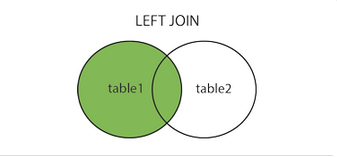

# **SQL Join**
***

## **A. Penjelasan**
SQL Join adalah Klausa JOIN digunakan untuk menggabungkan baris dari dua tabel atau lebih, berdasarkan kolom terkait di antara keduanya.

***

## **B. Macam-macam**
Berikut adalah berbagai jenis JOINs di SQL:

* (INNER) JOIN: Mengembalikan catatan yang memiliki nilai yang cocok di kedua tabel
* LEFT (OUTER) JOIN: Kembalikan semua catatan dari tabel kiri, dan catatan yang cocok dari tabel kanan
* RIGHT (OUTER) JOIN: Kembalikan semua catatan dari tabel kanan, dan catatan yang cocok dari tabel kiri
* FULL (OUTER) JOIN: Kembalikan semua catatan saat ada kecocokan di tabel kiri atau kanan

      

