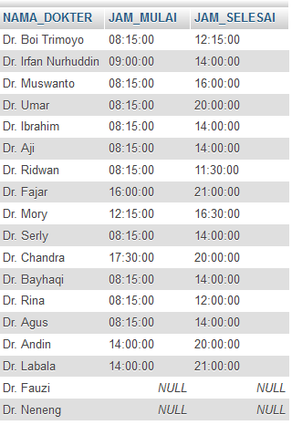
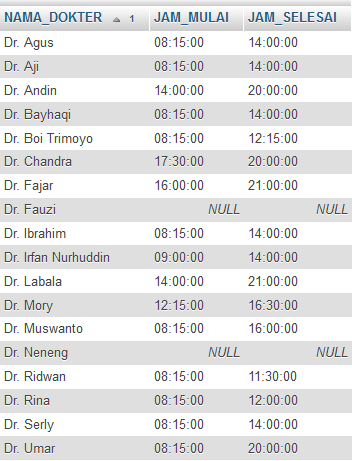
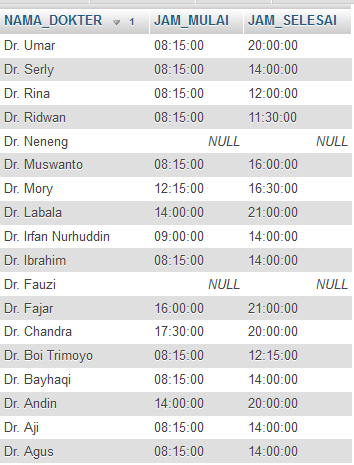
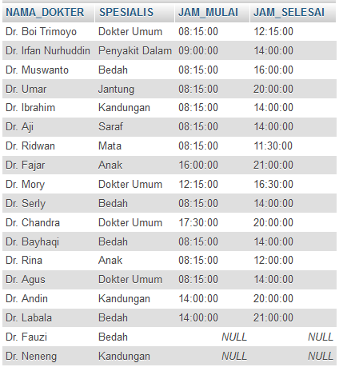
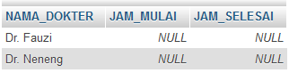

# **SQL Left Join**
***

## **A. Penjelasan**
SQL Left Join adalah Untuk mengembalikan semua record dari tabel kiri (table1), dan catatan yang cocok dari tabel kanan (table2). Hasilnya adalah NULL dari sisi kanan, jika tidak ada yang cocok.

***

## **B. Bentuk Syntax Umum**

		SELECT nama_kolom(s)
		FROM tabel1 LEFT JOIN tabel2 
		ON tabel1.nama_kolom = tabel2.nama_kolom; 
*** 

## **C. Implementasi**
### Contoh Case 
* Designer Database :

		Database = ukk_11102016_sbd_153140914111007_hildakhairunnisa
 

* Soal dan Jawaban Case :

Left Join dalam 2 tabel

**1. Menampilkan data dengan kolom (nama dokter, jam mulai jaga dan jam selesai jaga)** 

**NOTE : untuk mengetahui tabel ke 2 yang tidak terisi dan bernilai NULL**

		SELECT tb_dokter.NAMA_DOKTER, tb_jaga.JAM_MULAI, tb_jaga.JAM_SELESAI
		FROM tb_dokter LEFT JOIN tb_jaga
		ON tb_dokter.KD_DOKTER=tb_jaga.KD_DOKTER;

* Output                         

**2. Menampilkan data dengan kolom (nama dokter, jam mulai jaga dan jam selesai jaga)**

**NOTE : untuk mengetahui tabel ke 2 yang tidak terisi dan bernilai NULL, data diurutkan berdasarkan nama dokter (urut dari A-Z)**  

		SELECT tb_dokter.NAMA_DOKTER, tb_jaga.JAM_MULAI, tb_jaga.JAM_SELESAI
		FROM tb_dokter LEFT JOIN tb_jaga
		ON tb_dokter.KD_DOKTER=tb_jaga.KD_DOKTER
		ORDER BY tb_dokter.NAMA_DOKTER;

* Output                         
 

**3. Menampilkan data dengan kolom (nama dokter, jam mulai jaga dan jam selesai jaga)**

**NOTE : untuk mengetahui tabel ke 2 yang tidak terisi dan bernilai NULL, data diurutkan berdasarkan nama dokter (urut dari Z-A)**  

		SELECT tb_dokter.NAMA_DOKTER, tb_jaga.JAM_MULAI, tb_jaga.JAM_SELESAI
		FROM tb_dokter LEFT JOIN tb_jaga
		ON tb_dokter.KD_DOKTER=tb_jaga.KD_DOKTER
		ORDER BY tb_dokter.NAMA_DOKTER DESC;

* Output                         
 

Left Join dalam 3 tabel 

**Menampilkan data dengan kolom (nama dokter, nama spesialis, jam mulai jaga, jam selesai jaga)** 

**NOTE : untuk mengetahui tabel ke 2 atau ke 3 yang tidak terisi dan bernilai NULL**

		SELECT tb_dokter.NAMA_DOKTER, tb_spesialis.SPESIALIS, tb_jaga.JAM_MULAI, tb_jaga.JAM_SELESAI
		FROM ((tb_dokter LEFT JOIN tb_spesialis ON tb_dokter.KD_SPESIALIS = tb_spesialis.KD_SPESIALIS)
		LEFT JOIN tb_jaga ON tb_dokter.KD_DOKTER = tb_jaga.KD_DOKTER);

* Output                         
   

Left Join IS NULL

**Menampilkan data dengan kolom (nama dokter, jam mulai juga, jam selesai jaga)** 

**NOTE : untuk mengetahui tabel ke 2 yang hanya bernilai NULL**

		SELECT tb_dokter.NAMA_DOKTER, tb_jaga.JAM_MULAI, tb_jaga.JAM_SELESAI
		FROM tb_dokter LEFT JOIN tb_jaga
		ON tb_dokter.KD_DOKTER=tb_jaga.KD_DOKTER
		WHERE tb_jaga.KD_DOKTER IS NULL;

* Output                         
