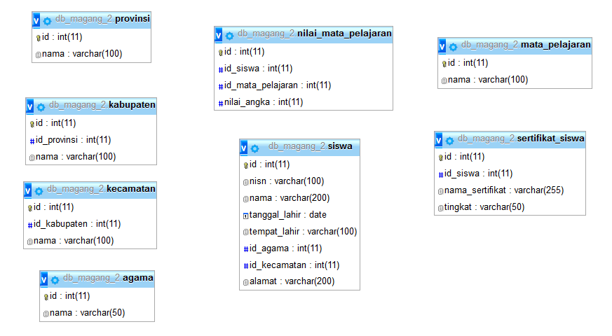
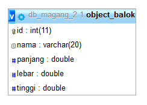
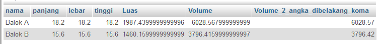

# **SQL Operator**
***

## **A. Penjelsan**
**a. SQL Operator Aritmatika** 

| Fungsi    |   Kegunaan           | 
|---------- | -------------------- | 
| +     	| untuk menambahkan    |
| -   		| untuk mengurangi 	   | 
| *   		| untuk mengkalikan    | 
| /   		| untuk membagikan 	   |
| %   		| untuk modulo		   |  

**b. SQL Operator Pembanding**

| Fungsi    |   Kegunaan                   | 
|---------- | -----------------------------| 
| =     	| sama dengan 		           |
| >   		| lebih besar dari 		       | 
| <   		| kurang dari	 			   |
| >=   		| lebih besar dari sama dengan |
| <=   		| kurang dari sama dengan	   |
| <>   		| tidak sebanding dengan	   |

**c. SQL Operator Logikal**

| Fungsi    |   Kegunaan                 							    | 
|---------- | ----------------------------------------------------------| 
| ALL     	| BENAR jika semua nilai subkueri memenuhi syarat 		    |
| AND   	| BENAR jika semua kondisi dipisahkan oleh DAN BENAR 		| 
| ANY   	| BENAR jika salah satu nilai subkueri memenuhi syarat		|
| BETWEEN   | BENAR jika operan berada dalam kisaran perbandingan 		|
| EXISTS   	| BENAR jika subkueri mengembalikan satu atau lebih catatan	|
| IN  		| BENAR jika operan sama dengan salah satu daftar ungkapan	|
| LIKE  	| BENAR jika operan cocok dengan pola	  				    |
| NOT  		| Menampilkan catatan jika kondisinya TIDAK BENAR	        |
| OR  		| BENAR jika salah satu kondisi dipisahkan oleh ATAU BENAR	|
| SOME  	| BENAR jika salah satu nilai subkueri memenuhi syarat	    |

***

## **B. Implementasi**
### Contoh Case 1

* Desaigner Database :

		Database = db_magang_2
 

* Soal dan Penyelesaian :
		
		Operator Pembanding : 
		1. =
		2. <>
		3. >
		4. <
		5. >=
		6. <=
		7. like '%a'
		8. like 'b%'
		9. like '%b%'
		10. in('a','b')
		11. not in('a','b')

Operator =
	
**1. Menampilkan seluruh data dengan kolom (nama siswa = YONDI)**

		SELECT *
		FROM siswa
		WHERE nama = 'YONDI'

**2. Menampilkan seluruh data dengan kolom (nama siswa = ADIT atau yang tempat lahirnya di MALANG)**

		SELECT *
		FROM siswa
		WHERE nama = 'ADIT' or tempat_lahir = 'MALANG'

**3. Menampilkan seluruh data dengan kolom (nama siswa = YONDI atau yang nama siswanya = ADIT, ALI, NIZAR)**

		SELECT *
		FROM siswa
		WHERE (nama = 'YONDI' or nama = 'ADIT' or nama = 'ALI' or nama = 'NIZAR')

**4. Menampilkan seluruh data dengan kolom (nama siswa = ADIT yang tempat lahirnya di MALANG)**

		SELECT *
		FROM siswa
		WHERE nama = 'ADIT' and tempat_lahir = 'MALANG'

Operator <> 

**Menampilkan seluruh data dengan kolom (id siswa = id ke 10)**

		SELECT *
		FROM siswa
		WHERE id <> 10

Operator > 

**1. Menampilkan seluruh data dengan kolom (tanggal lahir lebih besar dari 1992-10-20)**

		SELECT *
		FROM siswa
		WHERE siswa.tanggal_lahir > '1992-10-20'

**2. Menampilkan seluruh data dengan kolom (tanggal lahir lebih besar dari tahun 1992)**

		SELECT *
		FROM siswa
		WHERE siswa.tanggal_lahir > '1992’

Operator < 

**1. Menampilkan seluruh data dengan kolom (tanggal lahir kurang dari 1992-10-20)**

		SELECT *
		FROM siswa
		WHERE siswa.tanggal_lahir < '1992-10-20'

**2. Menampilkan seluruh data dengan kolom (tanggal lahir kurang dari yang tahunnya 1992)**

		SELECT *
		FROM siswa
		WHERE siswa.tanggal_lahir < '1992’

**3. Menampilkan seluruh data dengan kolom (nama siswa = ADIT yang tanggal lahirnya lebih besar dari 1992-10-20)** 

		select *
		from siswa
		where nama = 'ADIT' and tanggal_lahir < '1995-01-01'

Operator >= 

**1. Menampilkan seluruh data dengan kolom (tanggal lahir lebih besar dari sama dengan 1992-10-20)** 

		SELECT *
		FROM siswa
		WHERE siswa.tanggal_lahir >= '1992-10-20'

**2. Menampilkan seluruh data dengan kolom (tanggal lahir lebih besar dari sama dengan yang tahunnya 1992)**

		SELECT *
		FROM siswa
		WHERE siswa.tanggal_lahir >= '1992’

Operator <=

**1. Menampilkan seluruh data dengan kolom (tanggal lahir kurang dari sama dengan 1992-10-20)** 

		SELECT *
		FROM siswa
		WHERE siswa.tanggal_lahir <= '1992-10-20'

**2. Menampilkan seluruh data dengan kolom (tanggal lahir kurang dari sama dengan yang tahunnya 1992)**

		SELECT *
		FROM siswa
		WHERE siswa.tanggal_lahir <= '1992’

Operator like 'a%'

**Menampilkan seluruh data dengan kolom (nama siswa yang depannya huruf A)**

		SELECT *
		FROM siswa
		WHERE nama like 'a%' 

Operator like '%a'

**1. Menampilkan seluruh data dengan kolom (nama siswa yang belakangnya huruf A)**

		SELECT *
		FROM siswa
		WHERE nama like '%a' 

**2. Menampilkan seluruh data dengan kolom (nama siswa yang depannya huruf A dan AB)**

		SELECT *
		FROM siswa
		WHERE nama like 'a%' and nama like 'ab%'

Operator like '%ag%' 

**Menampilkan seluruh data dengan kolom (nama siswa yang memiliki huruf AG)**
		
		SELECT *
		FROM siswa
		WHERE nama like '%ag%' 

Operator in('a','b') 

**Menampilkan seluruh data dengan kolom (nama siswa = YONDI, ADIT)**
		
		SELECT *
		FROM siswa
		WHERE nama IN('YONDI','ADIT')

Operator not in('a','b') 

**Menampilkan seluruh data dengan selain kolom (nama siswa = YONDI, ADIT, ALI, NIZAR)**
		
		SELECT *
		FROM siswa
		WHERE nama NOT IN('YONDI','ADIT','ALI','NIZAR')
***

### Contoh Case 2
* Desaigner Database : 

		Database = db_magang_2
 

* Soal dan Penyelesaian :

		Operator Pembanding 
		1. =
		2. <>
		3. >
		4. <
		5. >=
		6. <=
		7. like '%a'
		8. like 'b%'
		9. like '%b%'
		10. in('a','b')
		11. not in('a','b')

Operator = 
		
**1. Menampilkan seluruh data dengan kolom (nama kabupaten = BLITAR)**
		
			SELECT *
			FROM kabupaten
			WHERE nama = 'BLITAR'

**2. Menampilkan seluruh data dengan kolom (id kabupaten = id ke 4)**
			
			SELECT *
			FROM kabupaten
			WHERE id = 4

**3. Menampilkan data dengan kolom (nama siswa = ADIT yang nama kabupatennya di KEDIRI**

			SELECT siswa.nama, kabupaten.nama
			FROM siswa INNER JOIN kabupaten
			ON siswa.nama = 'ADIT'AND kabupaten.nama = 'KEDIRI'

**4. Menampilkan data dengan kolom (nama siswa = YONDI atau yang nama siswanya = ADIT, ALI, NIZAR)**

			SELECT *
			FROM siswa
			WHERE (nama = 'YONDI' or nama = 'ADIT' or nama = 'ALI' or nama = 'NIZAR')

**5. Menampilkan data dengan kolom (nisn siswa, nama siswa = YONDI atau yang nama siswanya = "ADIT, ALI, NIZAR", nama mata pelajaran, nilai angka dari siswa untuk nama**

**NOTE : data diurutkan berdasarkan nama siswa (urut dari Z-A)** 

			SELECT siswa.nisn, siswa.nama, mata_pelajaran.nama, nilai_mata_pelajaran.nilai_angka
			FROM siswa, mata_pelajaran, nilai_mata_pelajaran
			WHERE siswa.id = nilai_mata_pelajaran.id_siswa 
			and mata_pelajaran.id = nilai_mata_pelajaran.id_mata_pelajaran 
			and siswa.nama = 'YONDI' or siswa.nama = 'ADIT' or siswa.nama = 'ALI' or siswa.nama = 'NIZAR'
			ORDER BY siswa.nama DESC

**6. Menampilkan data dengan kolom (nisn siswa, nama siswa, nama mata pelajaran, nilai kecuali nilai angka dari nilai mata pelajaran untuk nilai angka (75), nama mata pelajaran yang di tampilkan adalah BAHASA INDONESIA**

			SELECT siswa.nisn, siswa.nama, mata_pelajaran.nama, nilai_mata_pelajaran.nilai_angka
			FROM siswa, mata_pelajaran, nilai_mata_pelajaran
			WHERE siswa.id = nilai_mata_pelajaran.id_siswa 
			and mata_pelajaran.id = nilai_mata_pelajaran.id_mata_pelajaran 
			and nilai_mata_pelajaran.nilai_angka <> 75
			and mata_pelajaran.nama = 'BAHASA INDONESIA'

Operator <> 

**1. Menampilkan data dengan selain kolom (nama kabupaten = BLITAR)**

			SELECT *
			FROM kabupaten
			WHERE nama <> 'BLITAR'

**2. Menampilkan data dengan selain kolom (id kabupaten = id ke 4)**

			SELECT *
			FROM kabupaten
			WHERE id <> 4

**3. Menampilkan data dengan kolom (nisn siswa, nama siswa, nama mata pelajaran, kecuali nilai angka dari nilai mata pelajaran untuk nilai angka 75)**

			SELECT siswa.nisn, siswa.nama, mata_pelajaran.nama, nilai_mata_pelajaran.nilai_angka
			FROM siswa, mata_pelajaran, nilai_mata_pelajaran
			WHERE siswa.id = nilai_mata_pelajaran.id_siswa 
			and mata_pelajaran.id = nilai_mata_pelajaran.id_mata_pelajaran 
			and nilai_mata_pelajaran.nilai_angka <> (75)

Operator > **

**Menampilkan data dengan kolom (nisn siswa, nama siswa, nama mata pelajaran, nilai angka lebih besar dari nilai mata pelajaran untuk nilai angka 75)**

			SELECT siswa.nisn, siswa.nama, mata_pelajaran.nama, nilai_mata_pelajaran.nilai_angka
			FROM siswa, mata_pelajaran, nilai_mata_pelajaran
			WHERE siswa.id = nilai_mata_pelajaran.id_siswa 
			and mata_pelajaran.id = nilai_mata_pelajaran.id_mata_pelajaran 
			and nilai_mata_pelajaran.nilai_angka > (75)

Operator < 

**Menampilkan data dengan kolom (nisn siswa, nama siswa, nama mata pelajaran, nilai angka kurang dari nilai mata pelajaran untuk nilai angka 75)**

			SELECT siswa.nisn, siswa.nama, mata_pelajaran.nama, nilai_mata_pelajaran.nilai_angka
			FROM siswa, mata_pelajaran, nilai_mata_pelajaran
			WHERE siswa.id = nilai_mata_pelajaran.id_siswa 
			and mata_pelajaran.id = nilai_mata_pelajaran.id_mata_pelajaran 
			and nilai_mata_pelajaran.nilai_angka < (75)

Operator >= 

**Menampilkan data dengan kolom (nisn siswa, nama siswa, nama mata pelajaran, nilai angka lebih besar dari samadengan nilai mata pelajaran untuk nilai angka 75)**

			SELECT siswa.nisn, siswa.nama, mata_pelajaran.nama, nilai_mata_pelajaran.nilai_angka
			FROM siswa, mata_pelajaran, nilai_mata_pelajaran
			WHERE siswa.id = nilai_mata_pelajaran.id_siswa 
			and mata_pelajaran.id = nilai_mata_pelajaran.id_mata_pelajaran 
			and nilai_mata_pelajaran.nilai_angka >= (75)

Operator <= 

**Menampilkan data dengan kolom (nisn siswa, nama siswa, nama mata pelajaran, nilai angka kurang dari samadengan nilai mata pelajaran untuk nilai angka 75)**

			SELECT siswa.nisn, siswa.nama, mata_pelajaran.nama, nilai_mata_pelajaran.nilai_angka
			FROM siswa, mata_pelajaran, nilai_mata_pelajaran
			WHERE siswa.id = nilai_mata_pelajaran.id_siswa 
			and mata_pelajaran.id = nilai_mata_pelajaran.id_mata_pelajaran 
			and nilai_mata_pelajaran.nilai_angka <= (75)

Operator Like '%I' 

**1. Menampilkan data dengan kolom (nama siswa, nama agama, nama provinsi, nama kabupaten dan tanggal lahir siswa untuk nama siswa yang huruf belakangnya"AD")**

			SELECT siswa.nama, agama.nama, provinsi.nama, kabupaten.nama, siswa.tanggal_lahir 
			FROM siswa, agama, provinsi, kabupaten , kecamatan
			WHERE siswa.id_agama = agama.id 
			and siswa.id_kecamatan = kecamatan.id 
			and kecamatan.id_kabupaten = kabupaten.id 
			and kabupaten.id_provinsi = provinsi.id 
			and siswa.nama LIKE '%I'

**2. Menampilkan data dengan kolom (nama siswa, nama agama, nama provinsi, nama kabupaten dan tanggal lahir siswa untuk nama siswa yang huruf belakangnya"AD")** 

**NOTE : data diurutkan berdasarkan nama siswa (urut dari Z-A)  
			
			SELECT siswa.nama, agama.nama, provinsi.nama, kabupaten.nama, siswa.tanggal_lahir 
			FROM siswa, agama, provinsi, kabupaten , kecamatan
			WHERE siswa.id_agama = agama.id 
			and siswa.id_kecamatan = kecamatan.id 
			and kecamatan.id_kabupaten = kabupaten.id 
			and kabupaten.id_provinsi = provinsi.id 
			and siswa.nama LIKE '%I'
			ORDER BY siswa.nama DESC

Operator Like 'AD%'
	
**Menampilkan data dengan kolom (nama siswa, nama agama, nama provinsi, nama kabupaten dan tanggal lahir siswa untuk nama siswa yang huruf depannya "AD")**

			SELECT siswa.nama, agama.nama, provinsi.nama, kabupaten.nama, siswa.tanggal_lahir 
			FROM siswa, agama, provinsi, kabupaten , kecamatan
			WHERE siswa.id_agama = agama.id 
			and siswa.id_kecamatan = kecamatan.id 
			and kecamatan.id_kabupaten = kabupaten.id 
			and kabupaten.id_provinsi = provinsi.id 
			and siswa.nama LIKE 'AD%'

Operator Like '%DI%' 

**Menampilkan data dengan kolom (nama siswa, nama agama, nama provinsi, nama kabupaten dan tanggal lahir siswa untuk nama siswa yang ada huruf "DI")**

			SELECT siswa.nama, agama.nama, provinsi.nama, kabupaten.nama, siswa.tanggal_lahir 
			FROM siswa, agama, provinsi, kabupaten , kecamatan
			WHERE siswa.id_agama = agama.id 
			and siswa.id_kecamatan = kecamatan.id 
			and kecamatan.id_kabupaten = kabupaten.id 
			and kabupaten.id_provinsi = provinsi.id 
			and siswa.nama LIKE '%DI%'

Operator in () 

**Menampilkan data dengan kolom (nisn siswa, nama siswa, nama mata pelajaran, nilai angka dari nilai mata pelajaran untuk nilai angka 90 dan 75)**
			
			SELECT siswa.nisn, siswa.nama, mata_pelajaran.nama, nilai_mata_pelajaran.nilai_angka
			FROM siswa, mata_pelajaran, nilai_mata_pelajaran
			WHERE siswa.id = nilai_mata_pelajaran.id_siswa 
			and mata_pelajaran.id = nilai_mata_pelajaran.id_mata_pelajaran 
			and nilai_mata_pelajaran.nilai_angka IN (90,75)

Operator not in () 

**Menampilkan data dengan kolom (nama siswa, nama agama, nama provinsi, nama kabupaten dan tanggal lahir siswa untuk selain nama siswa (ADIT, ADITYA, ALI, ARIF))**

			SELECT siswa.nama, agama.nama, provinsi.nama, kabupaten.nama, siswa.tanggal_lahir 
			FROM siswa, agama, provinsi, kabupaten , kecamatan
			WHERE siswa.id_agama = agama.id 
			and siswa.id_kecamatan = kecamatan.id 
			and kecamatan.id_kabupaten = kabupaten.id 
			and kabupaten.id_provinsi = provinsi.id 
			and siswa.nama NOT IN ('ADIT', 'ADITYA', 'ALI', 'ARIF')
***

### Contoh Case 3
* Desaigner Database 

		Database = db_magang_2
  

* Soal dan Penyelesaian

**1. Menampilkan nama yg tidak memiliki sertifikat dan memiliki sertifikat**

		SELECT siswa.nama , sertifikat_siswa.nama_sertifikat 
		FROM siswa LEFT JOIN sertifikat_siswa 
		ON (sertifikat_siswa.id_siswa = siswa.id) 

**2. Menampilkan nama yg tidak memiliki sertifikat dengan NULL**

		SELECT siswa.nama , sertifikat_siswa.nama_sertifikat 
		FROM siswa left join sertifikat_siswa ON (sertifikat_siswa.id_siswa = siswa.id) 
		WHERE sertifikat_siswa.nama_sertifikat is NULL 

**3. Menampilkan nama yg tidak memiliki sertifikat hanya nama saja**

		SELECT siswa.nama
		FROM siswa
		WHERE siswa.id not in(select id_siswa from sertifikat_siswa)

**4. Menampilkan nama yg memiliki sertifikat**

		SELECT siswa.nama , sertifikat_siswa.nama_sertifikat 
		FROM siswa LEFT JOIN sertifikat_siswa ON (sertifikat_siswa.id_siswa = siswa.id) 
		WHERE sertifikat_siswa.nama_sertifikat is not NULL 

**5. Menampilkan yang tidak memiliki sertifikat, dengan Sub query, nilai lebih 80, mata pelajaran Matematika**

		SELECT siswa.nisn as 'nisn_siswa',
		siswa.nama as 'nama_siswa',
		mata_pelajaran.nama as 'nama_matkul',
		nilai_mata_pelajaran.nilai_angka as 'nilai_angka'
		FROM siswa, mata_pelajaran, nilai_mata_pelajaran
		WHERE (siswa.id = nilai_mata_pelajaran.id_siswa 
		and mata_pelajaran.id = nilai_mata_pelajaran.id_mata_pelajaran) 
		and siswa.id not in (select id_siswa FROM sertifikat_siswa) 
		and nilai_mata_pelajaran.nilai_angka > 80 
		and mata_pelajaran.nama = 'MATEMATIKA'
		ORDER BY siswa.nama;

**6. Menampilkan yang tidak memiliki sertifikat, dengan Sub query, nilai lebih 80, mata pelajaran Matematika, kabupaten Nganjuk**
		
		SELECT siswa.nisn as 'nisn_siswa',
		siswa.nama as 'nama_siswa',
		mata_pelajaran.nama as 'nama_matkul',
		nilai_mata_pelajaran.nilai_angka as 'nilai_angka'
		FROM siswa, mata_pelajaran, nilai_mata_pelajaran
		WHERE (siswa.id = nilai_mata_pelajaran.id_siswa 
		and mata_pelajaran.id = nilai_mata_pelajaran.id_mata_pelajaran) 
		and siswa.id not in (select id_siswa FROM sertifikat_siswa) 
		and nilai_mata_pelajaran.nilai_angka > 80 
		and mata_pelajaran.nama = 'MATEMATIKA'
		and id_kecamatan in(
		       select id from kecamatan where id_kabupaten in(
		             select id from kabupaten where nama = 'NGANJUK'
		       ) 
		)
		ORDER BY siswa.nama;

**7. Menampilkan yang tidak memiliki sertifikat, tidak dengan Sub query, nilai lebih 80, mata pelajaran Matematika, kabupaten Nganjuk**

		SELECT siswa.nisn as 'nisn_siswa',
		siswa.nama as 'nama_siswa',
		mata_pelajaran.nama as 'nama_matkul',
		nilai_mata_pelajaran.nilai_angka as 'nilai_angka'
		FROM siswa, mata_pelajaran, nilai_mata_pelajaran , kecamatan , kabupaten
		WHERE (siswa.id = nilai_mata_pelajaran.id_siswa 
		and mata_pelajaran.id = nilai_mata_pelajaran.id_mata_pelajaran) 
		and siswa.id not in (select id_siswa FROM sertifikat_siswa) 
		and nilai_mata_pelajaran.nilai_angka > 80 
		and mata_pelajaran.nama = 'MATEMATIKA'
		and siswa.id_kecamatan = kecamatan.id 
		and kabupaten.id = kecamatan.id_kabupaten
		and kabupaten.nama = 'NGANJUK'

**8. Menampilkan yang tidak memiliki sertifikat, tidak dengan Sub query, lebih dari 50, nama sertifikat terisi Null, diurutkan melalui Nama**

		SELECT siswa.nama, siswa.tanggal_lahir, agama.nama, kabupaten.nama, provinsi.nama, mata_pelajaran.nama, 
		nilai_mata_pelajaran.nilai_angka ,sertifikat_siswa.nama_sertifikat
		FROM siswa left join sertifikat_siswa on sertifikat_siswa.id_siswa = siswa.id , agama, kecamatan, kabupaten, provinsi, nilai_mata_pelajaran, mata_pelajaran
		WHERE siswa.id_agama = agama.id 
		and siswa.id_kecamatan = kecamatan.id 
		and kecamatan.id_kabupaten = kabupaten.id 
		and kabupaten.id_provinsi = provinsi.id 
		and nilai_mata_pelajaran.id_siswa = siswa.id 
		and mata_pelajaran.id = nilai_mata_pelajaran.id_mata_pelajaran 
		and nilai_mata_pelajaran.nilai_angka >50 and sertifikat_siswa.id_siswa is NULL
		ORDER BY siswa.nama;

### Contoh Case 4
* Desaigner Database :

		Database = db_magang_2.1
 

* Soal dan Jawaban Case :
	
		Soal :
		Tampilan Output Semua data (nama,panjang,lebar,luas,volume,volume_2_angka_dibelakang_koma)

		Keterangan Database :
		create table object_balok(
		nama varchar(20)
		panjang decimal(18,2)
		lebar decimal(18,2)
		tinggi decimal(18,2)
		)

** Tampilan output Semua data (nama,panjang,lebar,luas,volume,volume_2_angka_dibelakang_koma)**

* Source Code 

		SELECT nama, panjang, lebar, tinggi, 2*((panjang*lebar)+(panjang*tinggi)+(lebar*tinggi)) AS 'Luas',panjang*lebar*tinggi AS 'Volume',
		ROUND(panjang*lebar*tinggi,2) AS 'Volume_2_angka_dibelakang_koma'
		FROM object_balok

* Output                         
 
***

