# **SQL Order By**
***

## **A. Penjelasan**
SQL Order By adalah  untuk mengurutkan data dalam urutan menaik secara default 	dengan menggunakan ASC (Ascending) dan untuk mengurutkan data dalam urutan menurun, gunakan kata kunci DESC (Descending)
***

## **B. Bentuk Syntax Umum**

		SELECT kolom1, kolom2, ...
		FROM nama_tabel
		ORDER BY kolom1, kolom2, ... ASC|DESC;
***

## **C. Implementasi**
### Contoh Case 
* Desaigner Database :

		Database = db_magang_2
 

* Soal dan Penyelesaian :

**1. Menampilkan data dengan kolom (nama kabupaten)**

**NOTE : diurutkan berdasarkan nama kabupaten**
		
		SELECT kabupaten.nama as "nama_kabupaten"
		FROM kabupaten 
		ORDER BY nama_kabupaten;

* Output                         
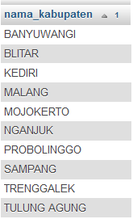

**2. Menampilkan data dengan kolomm (nama kabupaten)** 

** NOTE : menurut id kecamatan yang diurutkan berdasarkan nama kabupaten**

		SELECT kabupaten.nama as "nama_kabupaten"
		FROM kabupaten, kecamatan
		WHERE kabupaten.id=kecamatan.id_kabupaten
		ORDER BY nama_kabupaten;

* Output                         
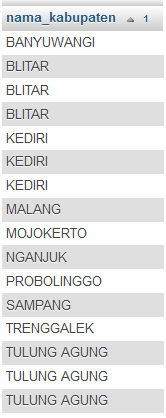

**3. Menampilkan data dengan kolom (nama kabupaten)** 

**NOTE : diurutkan berdasarkan id kabupaten**
	
		SELECT kabupaten.nama as "nama_kabupaten"
		FROM kabupaten 
		ORDER BY kabupaten.id;

* Output                         
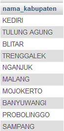

**4. Menampilkan data dengan kolom (nama kabupaten)**

**NOTE : menurut id kecamatan diurutkan berdasarkan id kabupaten**
	
		SELECT kabupaten.nama as "nama_kabupaten"
		FROM kabupaten, kecamatan
		WHERE kabupaten.id=kecamatan.id_kabupaten
		ORDER BY kabupaten.id;

* Output                         
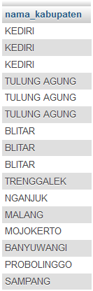

**5. Menampilkan data dengan kolom (nama kabupaten, nama kecamatan)**

**NOTE : menurut id kecamatan berdasarkan nama kabupaten dan nama kecamatan**

		SELECT kabupaten.nama , kecamatan.nama
		FROM kabupaten , kecamatan
		WHERE kabupaten.id = kecamatan.id_kabupaten
		ORDER BY 1 , 2;

		atau

		SELECT kabupaten.nama , kecamatan.nama
		FROM kabupaten , kecamatan
		WHERE kabupaten.id = kecamatan.id_kabupaten
		ORDER BY kabupaten.nama, kecamatan.nama; 

* Output                         
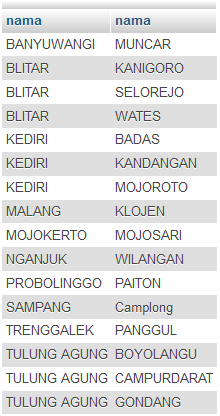

**6. Menampilkan data dengan kolom (nama kabupaten, nama kecamatan)** 

**NOTE : menurut id kecamatan, data diurutkan berdasarkan nama kabupaten (urut dari Z-A) dan nama kecamatan (urut dari A-Z)** 

		SELECT kabupaten.nama , kecamatan.nama
		FROM kabupaten , kecamatan
		WHERE kabupaten.id = kecamatan.id_kabupaten
		ORDER BY 1 DESC , 2 ASC;

		atau

		SELECT kabupaten.nama , kecamatan.nama
		FROM kabupaten , kecamatan
		WHERE kabupaten.id = kecamatan.id_kabupaten
		ORDER BY 1 DESC , 2;

		atau

		SELECT kabupaten.nama , kecamatan.nama
		FROM kabupaten , kecamatan
		WHERE kabupaten.id = kecamatan.id_kabupaten
		ORDER BY kabupaten.nama DESC , kecamatan.nama ASC;

		atau

		SELECT kabupaten.nama , kecamatan.nama
		FROM kabupaten , kecamatan
		WHERE kabupaten.id = kecamatan.id_kabupaten
		ORDER BY kabupaten.nama DESC , kecamatan.nama ;

* Output                         
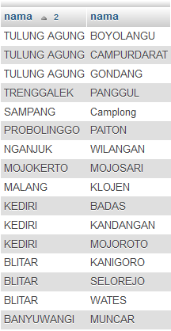

**7. Menampilkan data dengan kolom (nama kabupaten, nama kecamatan)** 

**NOTE : data diurutkan berdasarkan nama kabupaten (urut dari A-Z) dan nama kecamatan (urut dari Z-A)**

		SELECT kabupaten.nama , kecamatan.nama
		FROM kabupaten , kecamatan
		WHERE kabupaten.id = kecamatan.id_kabupaten
		ORDER BY 1 ASC, 2 DESC;

		atau 

		SELECT kabupaten.nama , kecamatan.nama
		FROM kabupaten , kecamatan
		WHERE kabupaten.id = kecamatan.id_kabupaten
		ORDER BY 1, 2 DESC;

		atau

		SELECT kabupaten.nama , kecamatan.nama
		FROM kabupaten , kecamatan
		WHERE kabupaten.id = kecamatan.id_kabupaten
		ORDER BY kabupaten.nama ASC, kecamatan.nama DESC;

		atau 

		SELECT kabupaten.nama , kecamatan.nama
		FROM kabupaten , kecamatan
		WHERE kabupaten.id = kecamatan.id_kabupaten
		ORDER BY kabupaten.nama, kecamatan.nama DESC;

* Output                         
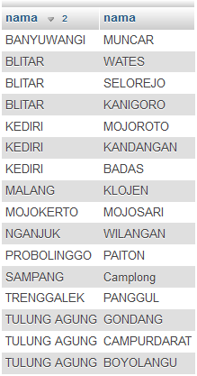

**8. Menampilkan data dengan kolom (nama siswa, nama Agama, nama Provinsi, nama Kota, tanggal_lahir)**

**NOTE : data diurutkan berdasarkan nama siswa (urut dari A-Z)**

		SELECT siswa.nama, agama.nama, provinsi.nama, kabupaten.nama, siswa.tanggal_lahir 
		FROM siswa, agama, provinsi, kabupaten , kecamatan
		WHERE siswa.id_agama = agama.id 
		and siswa.id_kecamatan = kecamatan.id 
		and kecamatan.id_kabupaten = kabupaten.id 
		and kabupaten.id_provinsi = provinsi.id order by siswa.nama ASC;

* Output                         
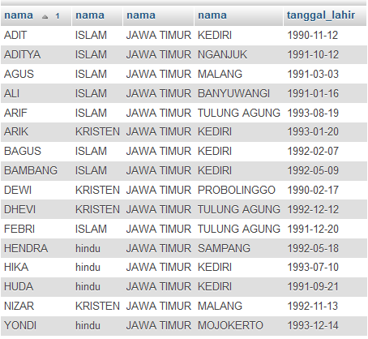

**9. Menampilkan data dengan kolom (NISN, nama siswa, nama Mata Pelajaran, Nilai Angka)**

**NOTE : data diurutkan berdasarkan nama siswa (urut dari A-Z) dan nama mata pelajaran (urut dari A-Z)**

		SELECT siswa.nisn, siswa.nama, mata_pelajaran.nama, nilai_mata_pelajaran.nilai_angka
		FROM siswa, mata_pelajaran, nilai_mata_pelajaran
		WHERE siswa.id = nilai_mata_pelajaran.id_siswa 
		and mata_pelajaran.id = nilai_mata_pelajaran.id_mata_pelajaran 
		order by siswa.nama, mata_pelajaran.nama ASC;

* Output                         
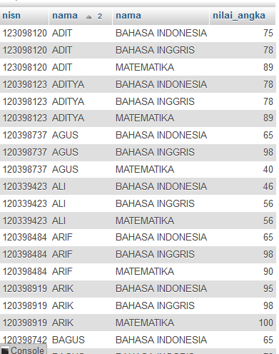 

**10. Menampilkan data dengan kolom (NISN, nama siswa, Nama Sertifikat, Tingkat Sertifikat)**

		SELECT siswa.nisn, siswa.nama, sertifikat_siswa.nama_sertifikat AS Nama_Sertifikat, sertifikat_siswa.tingkat AS Tingkat_Sertifikat
		FROM siswa , sertifikat_siswa
		WHERE siswa.id = sertifikat_siswa.id_siswa;

* Output                         
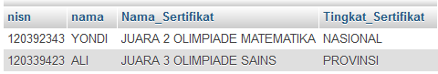 

**11. Menampilkan data dengan kolom (nama siswa, nama Agama, nama Provinsi, nama Kota, tanggal_lahir, nama Mata Pelajaran, Nilai Angka)**

**NOTE : data diurutkan berdasarkan nama siswa (urut dari Z-A)**

* Source Code

		SELECT siswa.nama , agama.nama AS Agama , provinsi.nama AS Provinsi , kabupaten.nama  AS Kabupaten, siswa.tanggal_lahir , mata_pelajaran.nama AS Mata_Pelajaran, nilai_mata_pelajaran.nilai_angka
		FROM siswa , agama , provinsi , kabupaten , kecamatan , nilai_mata_pelajaran , mata_pelajaran
		WHERE siswa.id_agama = agama.id and siswa.id_kecamatan = kecamatan.id and kecamatan.id_kabupaten = kabupaten.id and kabupaten.id_provinsi = provinsi.id and (siswa.id = nilai_mata_pelajaran.id_siswa) and mata_pelajaran.id = nilai_mata_pelajaran.id_mata_pelajaran order by siswa.nama DESC;

* Output                         
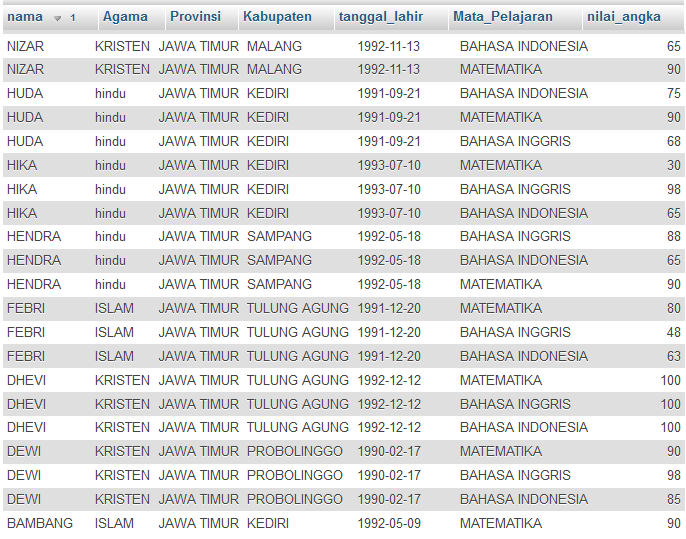 