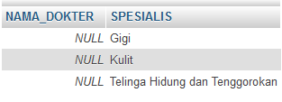

# **SQL Right Join**
***

## **A. Penjelasan**
SQL Right Join adalah Untuk mengembalikan semua catatan dari tabel kanan (table2), dan catatan yang cocok dari tabel kiri (table1). Hasilnya adalah NULL dari sisi kiri, bila tidak ada yang cocok.

***

## **B. Bentuk Syntax Umum**

		SELECT nama_kolom(s)
		FROM tabel1 RIGHT JOIN tabel2 
		ON tabel1.nama_kolom = tabel2.nama_kolom; 
*** 

## **C. Implementasi**
### Contoh Case 
* Designer Database :

		Database = ukk_11102016_sbd_153140914111007_hildakhairunnisa
 

* Soal dan Jawaban Case :

Right Join dalam 2 tabel

**1. Menampilkan data dengan kolom (nama dokter, nama spesialis)**

**NOTE : untuk mengetahui tabel ke 1 yang tidak terisi dan bernilai NULL**

		SELECT tb_dokter.NAMA_DOKTER, tb_spesialis.SPESIALIS
		FROM tb_dokter RIGHT JOIN tb_spesialis 
		ON tb_dokter.KD_SPESIALIS = tb_spesialis.KD_SPESIALIS;

* Output                         
     

**2. Menampilkan data dengan (nama dokter, nama spesialis)**

**NOTE: untuk mengetahui tabel ke 1 yang tidak terisi dan bernilai NULL, data diurutkan berdasarkan nama dokter (urut dari A-Z)**

		SELECT tb_dokter.NAMA_DOKTER, tb_spesialis.SPESIALIS
		FROM tb_dokter RIGHT JOIN tb_spesialis 
		ON tb_dokter.KD_SPESIALIS = tb_spesialis.KD_SPESIALIS
		ORDER BY tb_dokter.NAMA_DOKTER;

* Output                         
  

**3. Menampilkan data dengan kolom (nama dokter, nama spesialis)** 

**NOTE: untuk mengetahui tabel ke 1 yang tidak terisi dan bernilai NULL, data diurutkan berdasarkan nama dokter (urut dari Z-A)**

		SELECT tb_dokter.NAMA_DOKTER, tb_spesialis.SPESIALIS
		FROM tb_dokter RIGHT JOIN tb_spesialis 
		ON tb_dokter.KD_SPESIALIS = tb_spesialis.KD_SPESIALIS
		ORDER BY tb_dokter.NAMA_DOKTER DESC;

* Output                         
  

Right Join IS NULL

**Menampilkan data dengan kolom (nama dokter, nama spesialis)**

**NOTE : untuk mengetahui tabel ke 1 yang hanya bernilai NULL**

		SELECT tb_dokter.NAMA_DOKTER, tb_spesialis.SPESIALIS
		FROM tb_dokter RIGHT JOIN tb_spesialis 
		ON tb_dokter.KD_SPESIALIS = tb_spesialis.KD_SPESIALIS
		WHERE tb_dokter.KD_SPESIALIS IS NULL;

* Output                         
  