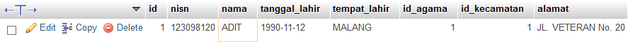

# **SQL Select**
***

## **A. Penjelasan**
Pernyataan SELECT digunakan untuk memilih data dari database.
Data yang dikembalikan disimpan dalam tabel hasil, yang disebut result-set.

 

* Projection : Memilih kolom-kolom dalam suatu tabel yang dihasilkan dari suatu query. Memilih beberapa atau banyak kolom yang dibutuhkan.

* Selection : Memilih baris-baris dalam suatu tabel yang dihasilkan dari suatu query. Banyak kriteria yang dapat digunakan untuk membatasi baris-baris yang akan diambil.

* Joining : Mengambil data bersama yang disimpan dalam tabel-tabel
***

## **B. Bentuk Syntax Umum**

Menampilkan semua data

		SELECT * FROM nama_tabel;

Projection

		SELECT kolom1, kolom2, ...
		FROM nama_tabel;

Selection
		
		SELECT * FROM table1 WHERE kolom1 = "Result"

		SELECT kolom1, kolom2 FROM tabel1 WHERE kolom1 = "Result"
***

## **C. Implementasi** 
### Contoh Case 
* Desaigner Database :

		Database = db_magang_2
 

* Soal dan Penyelesaian :

**Menampilkan seluruh data di tabel siswa**

		SELECT * FROM siswa;

* Output 
 

Projection

**Menampilkan data dengan kolom (nisn siswa, nama siswa)**

		SELECT nisn, nama
		FROM siswa;

* Output                                                    
 

Selection

**1. Menampilkan seluruh data di tabel siswa, yang bernama ADIT**

		SELECT * 
		FROM siswa WHERE nama = "ADIT";

* Output                                                    
 

**2. Menampilkan data dengan kolom (nisn siswa, nama siswa), yang bernama ADIT** 

		SELECT nisn, nama 
		FROM siswa WHERE nama = “ADIT” 

* Output                                                    
 