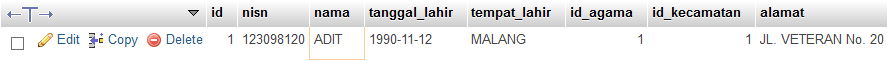

# **SQL Where**
***

## **A. Penjelasan**

Klausa WHERE digunakan untuk menyaring catatan.
Klausa WHERE digunakan untuk mengekstrak hanya catatan yang memenuhi persyaratan tertentu.
***

## **B. Bentuk Syntax Umum**

		SELECT kolom1, kolom2, ...
		FROM nama_tabel
		WHERE kondisi;
***

## **C. Implementasi** 
### Contoh Case 
* Desaigner Database :

		Database = db_magang_2
 

* Soal dan Penyelesaian :

Klausa WHERE

**Menampilkan data dengan kolom (nama siswa = ADIT)**

		SELECT * FROM siswa
		WHERE nama='ADIT';

* Output
 

Teks dan numerik

**Menampilkan data dengan kolom (id siswa = id ke 1)**

		SELECT * FROM siswa
		WHERE id='1';

* Output
 