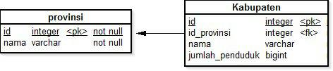
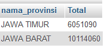

# Tes Magang PT. Lintang Kawuryan Malang
***

## Tes Magang 

* Soal

	a. Buatlah Relasi Database                                                    
 

	b. Tampilkan nama provinsi, nama kabupaten, jumlah penduduk menurut nama kabupaten
 

	c. Tampilkan nama provinsi, jumlah penduduk menurut id provinsi                               
 

* Penyelesaian

	a. Relasi Database                                    
 

	b. Menampilkan nama provinsi, nama kabupaten, jumlah penduduk menurut nama kabupaten

			SELECT provinsi.nama_provinsi, Kabupaten.nama_kabupaten, kabupaten.jumlah_penduduk 
			FROM provinsi INNER JOIN kabupaten 
			ON provinsi.id_provinsi=kabupaten.id_provinsi	
			
	* Output                                       
	

	c. Menampilkan nama provinsi, jumlah penduduk menurut id provinsi

			SELECT provinsi.nama_provinsi, SUM(kabupaten.jumlah_penduduk) AS 'Total' 
			FROM provinsi INNER JOIN kabupaten 
			ON provinsi.id_provinsi = kabupaten.id_provinsi GROUP BY provinsi.id_provinsi

	* Output                     
	
