# **Virtual Box**
***

## **A. Penjelasan**

VirtualBox adalah sebuah software yang berfungsi untuk metode pembelajaran dalam menginstall OS (Operating System) secara virtual. Jadi pada intinya anda jika ingin belajar menginstall PC tidak perlu membongkar dan install ulang, cukup menggunakan VirtualBox anda pun bisa menginstall OS ke dalam PC. Hanya saja sifatnya virtual, tetapi tidak akan jauh beda dengan yang aslinya. Kata virtualisasi juga merujuk ke kamus Oxford (Convert "something" to a computer-generated simulation of reality) yang artinya Mengubah atau mengkonversi ke bentuk simulasi dari bentuk yang real/nyata.

Oracle VM VirtualBox atau sering disebut dengan VirtualBox adalah perangkat lunak virtualisasi yang dapat digunakan untuk mengeksekusi sistem operasi “tambahan” di dalam sistem operasi “utama”. Sebagai contoh, jika seseorang mempunyai sistem operasi MS Windows yang terpasang di komputernya, maka yang bersangkutan dapat pula menjalankan sistem operasi lain yang diinginkan di dalam sistem operasi MS Windows tersebut.
VirtualBox bebas didownload dan digunakan (lisensi GNU GPL versi 2) serta mendukung banyak jenis sistem operasi, baik untuk versi 32 bit maupun 64 bit, baik sebagai host, mulai sistem operasi Windows, Linux, Macintosh, dan Solaris, serta sebagai guest untuk lebih banyak sistem operasi, mulai dari Windows (NT 4.0, 2000, XP, 2003 Server, Vista, Windows 7, Windows 8), DOS/Windows 3.x, Linux (2.4, 2.6 dan 3.x), Solaris dan OpenSolaris, OS/2, sampai OpenBSD.: Cara Install 
***

## **B. Tutorial Installasi**

### Install Virtual Box

1. Instalasi VirtualBox dapat menggunakan file instalasi (offline) atau secara online. Instalasi online hanya dapat dilakukan untuk hosts Linux. Untuk sistem operasi Windows (32 bit atau 64 bit), download file aplikasi VirtualBox di bagian VirtualBox for Windows hosts. Selanjutnya klik dua kali pada file aplikasi VirtualBox yang telah didownload tersebut. 
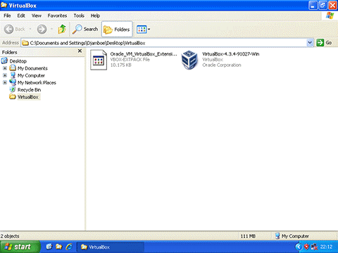 

2. Selanjutnya muncul layar selamat datang dalam proses instalasi VirtualBox. Klik tombol Next untuk proses selanjutnya.
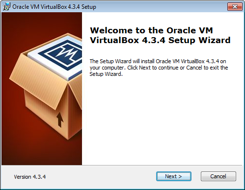 

3. Di bagian ini, kita dapat menentukan fitur apa yang akan diinstall atau tidak, mulai dari dukungan terhadap USB, jaringan sampai script Phyton untuk VirtualBox API. Di bagian ini kita juga dapat menentukan lokasi folder VirtualBox akan diinstall. Biarkan seluruh pengaturan folder dan fitur aplikasi yang akan diinstall. Klik tombol Next untuk proses selanjutnya.                 
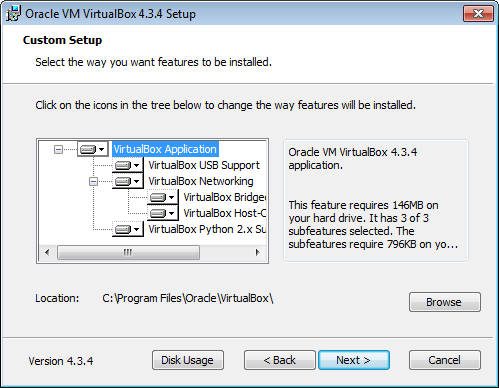 

4. Di bagian ini, kita dapat menentukan apakah cara akses VirtualBox secara cepat (shortcut) akan diinstall pada bagian desktop dan Quick Launch Bar. Aktifkan Register file associations agar file dengan ekstensi terkait VirtualBox dikenal oleh sistem operasi. Klik tombol Next untuk proses selanjutnya.
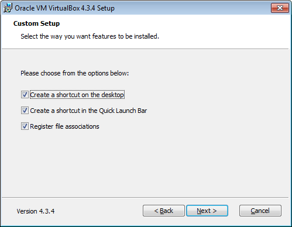 

5. Selanjutnya muncul pemberitahuan, bahwa dalam proses instalasi, interface atau kartu jaringan yang ada pada komputer akan dinonaktifkan untuk sementara waktu, namun akan diaktifkan kembali secara otomatis, dengan tambahan kartu jaringan virtual bawaan dari VirtualBox. Klik tombol Yes untuk melanjutkan proses instalasi.
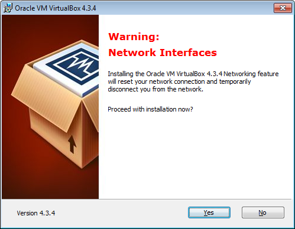 

6. VirtualBox sudah memiliki informasi yang diperlukan dan siap untuk diinstall. Klik tombol Install untuk memulai proses instalasi VirtualBox.
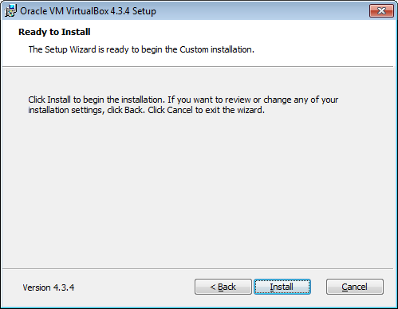 

7. Pada Windows 7 atau Windows 8, akan muncul layar pop-up User Account Control yang meminta konfirmasi apakah kita akan menginstall aplikasi VirtualBox ke dalam komputer. Klik tombol Yes untuk memulai proses instalasi.
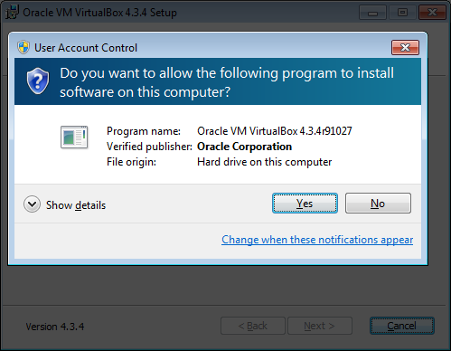 

8. Proses instalasi dan penyalinan file aplikasi VirtualBox sedang dilakukan.
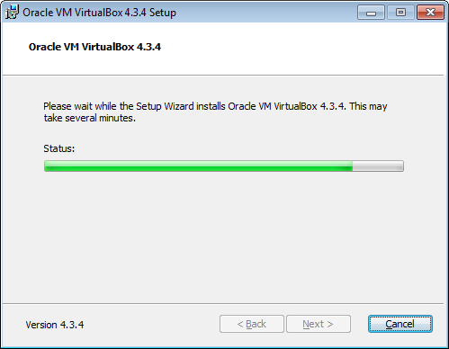 

9. Apabila dalam proses instalasi muncul pertanyaan terkait keamanan sistem, tandai kotak konfirmasi Always trust software from "Oracle Corporation" kemudian tekan tombol Install. Jika yang ditekan adalah tombol Dont Install maka proses instalasi akan dihentikan. Dan apabila kotak konfirmasi Always trust software from "Oracle Corporation" tidak diaktifkan, maka pertanyaan terkait keamanan akan muncul beberapa kali dan kita harus menekan tombol Install untuk menyelesaikan proses instalasi VirtualBox.
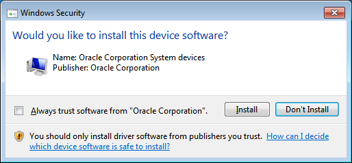 

10. Layar selanjutnya menginformasikan bahwa instalasi VirtualBox sudah selesai dilakukan. Klik tombol Finish untuk keluar dari proses instalasi dan menjalankan aplikasi VirtualBox.
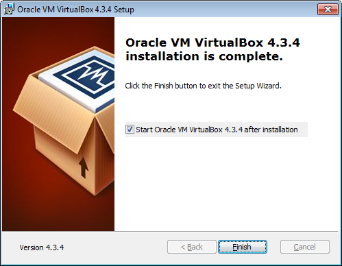 

11. Tampilan ruangan aplikasi VirtualBox yang baru diinstall.
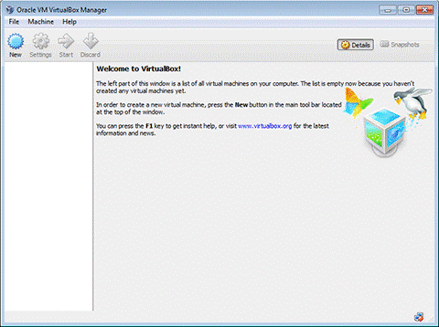

12. Jika sudah ada sistem operasi guest yang diinstall, maka akan ditampilkan pada layar sebelah kiri. Indikator Running pada sistem operasi guest menandakan sistem operasi guest sedang aktif. Sementara bagian sebelah kanan merupakan informasi tentang sistem operasi guest yang dipilih.                                                                     
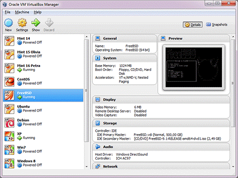
***
