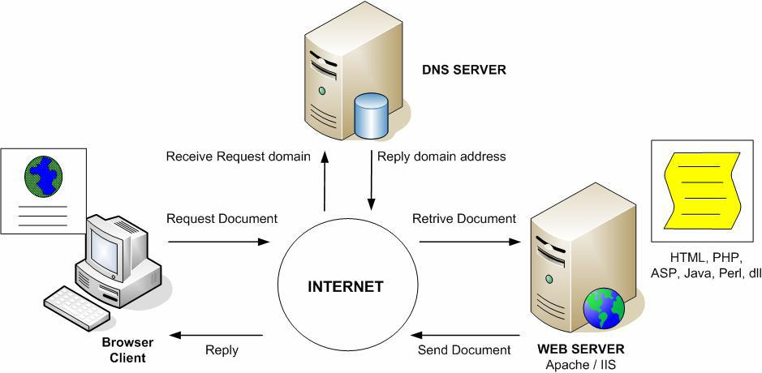

# **Web Server**
***

## **A. Penjelasan**

Merupakan perangkat lunak (software) dalam server yang berfungsi untuk menerima permintaan (request) berupa halaman web melalui protokol HTTP dan atau HTTPS dari client yang lebih dikenal dengan nama browser, kemudian mengirimkan kembali (respon) hasil permintaan tersebut ke dalam bentuk halaman-halaman web yang pada umumnya berbentuk dokumen HTML.Pada pengembangan web tradisional, kita umumnya menggunakan sebuah web server seperti Apache HTTPD atau nginx sebagai penyalur konten statis seperti HTML, CSS, Javascript, maupun gambar. Untuk menambahkan aplikasi web kita kemudian menggunakan penghubung antar web server dengan program yang dikenal dengan nama CGI (Common Gateway Interface).
CGI diimplementasikan pada web server sebagai antarmuka penghubung antara web server dengan program yang akan menghasilkan konten secara dinamis. Program-program CGI biasanya dikembangkan dalam bentuk script, meskipun dapat saja dikembangkan dalam bahasa apapun. Contoh dari bahasa pemrograman dan program yang hidup di dalam CGI adalah PHP.Berikut cara kerja CGI dan Web Server

a. Fungsi Web Server

Untuk mentransfer atau memindahkan berkas yang diminta oleh pengguna melalui protokol komunikasi tertentu. Oleh karena dalam satu halaman web biasanya terdiri dari berbagai macam jenis berkas seperti gambar, video, teks, audio, file dan lain sebagainya, maka pemanfaatan web server berfungsi juga untuk mentransfer keseluruhan aspek pemberkasan dalam halaman tersebut, termasuk teks, gambar, video, audio, file dan sebagainya.

Pada saat anda ingin mengakses sebuah halaman website, biasanya anda mengetik halaman tersebut di browser seperti mozilla, chrome dan lain-lain. Setelah anda meminta (biasanya dengan menekan enter) untuk dapat mengakses halaman tersebut, browser akan melakukan permintaan ke web server. Disinilah web server berperan, web server akan mencarikan data yang diminta browser, lalu mengirimkan data tersebut ke browser atau menolaknya jika ternyata data yang diminta tidak ditemukan.

b. Contoh Web Server

Beberapa contoh web server yang paling banyak digunakan diantaranya adalah :

* Apache
* Apache Tomcat
* Microsoft Internet Information Services (IIS)
* Nginx
* Lighttpd
* Litespeed
* Zeus Web Server

c. Fitur-fitur standar web server 

Fitur - fitur standar web server :

* HTTP  (Hypertext Transfer Protocol) adalah protokol yang digunakan oleh web server dan web browser untuk dapat berkomunikasi antara satu sama lain.
* HTTPS (Hypertext Transfer Protocol Secure) adalah merupakan versi aman (secure) dari HTTP. Biasanya protokol HTTP menggunakan port 80 dan protokol HTTPS menggunakan port 443.
* Logging
* Virtual Hosting
* Pengaturan Bandwidth
* Otektifikasi
* Kompresi Konten
***

## **B. Cara Kerja**
 

Yang dapat kita tarik dari gambar di atas :

* Web Server  yang berhadapan langsung dengan pengguna, menerima HTTP Request dan mengembalikan HTTP Response.
* Untuk konten statis seperti CSS, Javascript, gambar, maupun HTML web server dapat langsung menyajikannya sebagai HTTP Response kepada pengguna.
* Konten dinamis seperti program PHP maupun Perl disajikan melalui CGI.
* CGI Script kemudian menghasilkan HTML atau konten statis lainnya yang akan disajikan sebagai HTTP Response kepada pengguna.

