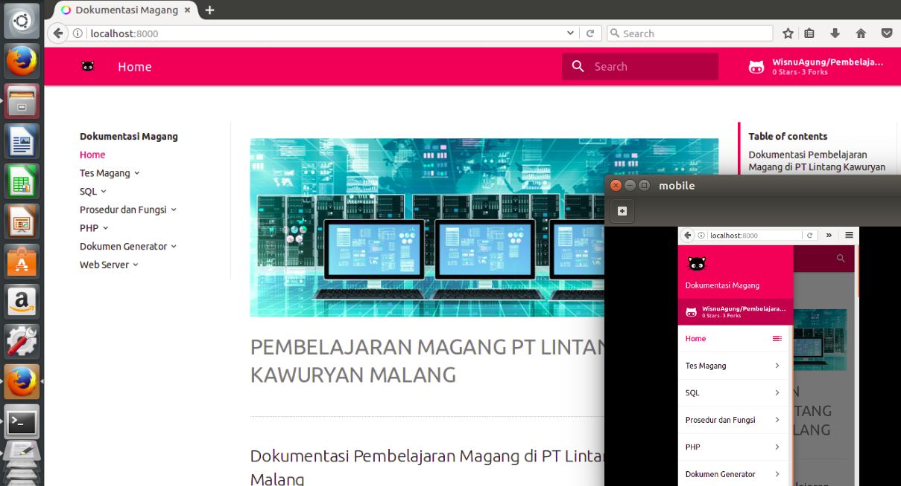

# Bagaimana cara menggunakan ?




## Install Python

***Windows***

Instal Python dengan mendownload installer yang sesuai untuk sistem anda dari python.org dan menjalankannya.

***Linux***

Instal Python dengan menggunakan perintah di terminal :

	sudo apt-get install python


## Install pip

Jika anda menggunakan Python versi terbaru, pengelola paket Python, kemungkinan besar pip terinstal secara default. Namun, Anda mungkin perlu meng-upgrade pip ke versi terakhir :

	pip install --upgrade pip

***Windows***

Jika Anda perlu menginstal pip untuk pertama kalinya, download get-pip.py. Kemudian jalankan perintah berikut untuk menginstalnya:
	
	python get-pip.py

***Linux***

Instal dengan menggunakan perintah ini di terminal :

	sudo apt install python-pip 


## Install MkDocs

Install paket mkdocs menggunakan pip:

	pip install mkdocs


## Install theme **Material** untuk MkDocs

Material Design theme untuk [MkDocs](http://www.mkdocs.org).

[](http://squidfunk.github.io/mkdocs-material/)

## Tutorial

Install dengan `pip`:

``` sh
pip install mkdocs-material
```

Tambahkan baris berikut ke yang ada `mkdocs.yml`:

``` yaml
theme: 'material'
```

## License

Copyright (c) 2017-2018 
-Anak Magang LKawuryan-

